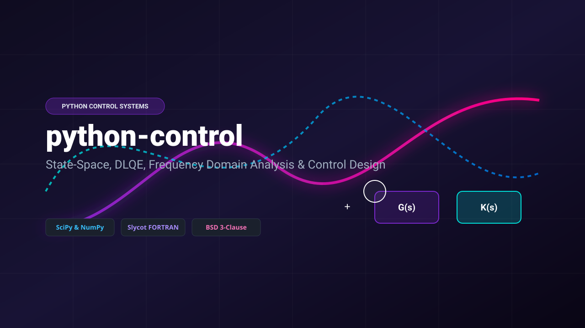
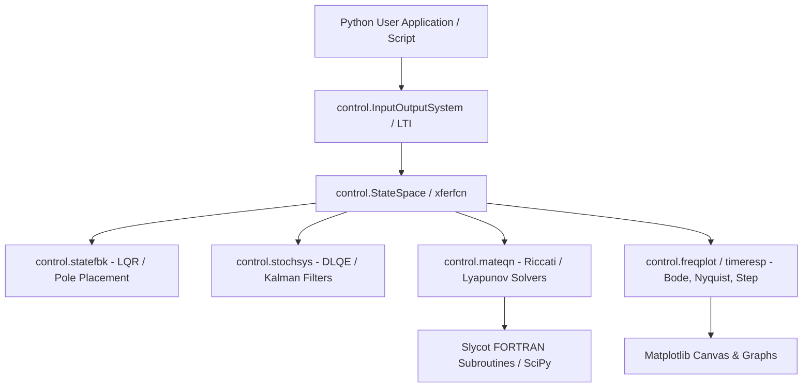

<div align="center">
  

  # python-control (dlqe branch)

  **The Python Control Systems Library: Analysis, Feedback Control, DLQE Estimators & LQR Design.**

  [](https://www.python.org/)
  [](https://numpy.org/)
  [](https://scipy.org/)
  [](https://matplotlib.org/)
  [](https://github.com/python-control/Slycot)
  [](LICENSE)
</div>

---

## Architectural Overview



### Component Matrix

| Module Path | Core Purpose & Architecture Role | Key Algorithms & Exported APIs |
|---|---|---|
| `control/statesp.py` | State-space representation of continuous and discrete systems | `StateSpace`, `ss`, state transformations |
| `control/xferfcn.py` | Transfer function representation in Laplace ($s$) or $z$-domain | `TransferFunction`, `tf`, pole-zero cancellation |
| `control/stochsys.py` | Stochastic system estimation, DLQE, and Kalman filtering | `dlqe`, `lqe`, `white_noise`, covariance computation |
| `control/statefbk.py` | Linear Quadratic Regulator (LQR) and pole placement state feedback | `lqr`, `dlqr`, `place`, `ctrb`, `obsv` |
| `control/mateqn.py` | Continuous and discrete Algebraic Riccati & Lyapunov solvers | `care`, `dare`, `lyap`, `dlyap` |
| `control/freqplot.py` | Frequency response graphing utilities | `bode_plot`, `nyquist_plot`, `gangof4` |
| `control/timeresp.py` | Time domain step, impulse, and forced initial condition responses | `step_response`, `impulse_response`, `forced_response` |
| `control/nlsys.py` | Non-linear system simulation and trajectory optimization | `NonlinearIOSystem`, `interconnect` |

---

## Original Developer Documentation

```rst
.. image:: https://anaconda.org/conda-forge/control/badges/version.svg
   :target: https://anaconda.org/conda-forge/control

.. image:: https://img.shields.io/pypi/v/control.svg
   :target: https://pypi.org/project/control/

.. image:: https://github.com/python-control/python-control/actions/workflows/python-package-conda.yml/badge.svg
   :target: https://github.com/python-control/python-control/actions/workflows/python-package-conda.yml

.. image:: https://github.com/python-control/python-control/actions/workflows/install_examples.yml/badge.svg
   :target: https://github.com/python-control/python-control/actions/workflows/install_examples.yml

.. image:: https://github.com/python-control/python-control/actions/workflows/control-slycot-src.yml/badge.svg
   :target: https://github.com/python-control/python-control/actions/workflows/control-slycot-src.yml

.. image:: https://coveralls.io/repos/python-control/python-control/badge.svg
   :target: https://coveralls.io/r/python-control/python-control

Python Control Systems Library
==============================

The Python Control Systems Library is a Python module that implements basic
operations for analysis and design of feedback control systems.

Have a go now!
--------------
Try out the examples in the examples folder using the binder service.

.. image:: https://mybinder.org/badge_logo.svg
 :target: https://mybinder.org/v2/gh/python-control/python-control/HEAD

The package can also be installed on Google Colab using the commands::

  %pip install control
  import control as ct

Features
--------

- Linear input/output systems in state-space and frequency domain
- Block diagram algebra: serial, parallel, feedback, and other interconnections
- Time response: initial, step, impulse
- Frequency response: Bode, Nyquist, and Nichols plots
- Control analysis: stability, reachability, observability, stability margins, root locus
- Control design: eigenvalue placement, linear quadratic regulator, sisotool, hinfsyn, rootlocus_pid_designer
- Estimator design: linear quadratic estimator (Kalman filter)
- Nonlinear systems: optimization-based control, describing functions, differential flatness

Links
-----

- Project home page: https://python-control.org
- Source code repository: https://github.com/python-control/python-control
- Documentation: https://python-control.readthedocs.io/
- Issue tracker: https://github.com/python-control/python-control/issues
- Mailing list: https://sourceforge.net/p/python-control/mailman/

Dependencies
------------

The package requires numpy, scipy, and matplotlib.  In addition, some routines
use a module called slycot, that is a Python wrapper around some FORTRAN
routines.  Many parts of python-control will work without slycot, but some
functionality is limited or absent, and installation of slycot is recommended
(see below). The Slycot wrapper can be found at:

https://github.com/python-control/Slycot


Installation
============

Conda and conda-forge
---------------------

The easiest way to get started with the Control Systems library is
using `Conda <https://conda.io>`_.

The Control Systems library has packages available using the `conda-forge
<https://conda-forge.org>`_ Conda channel, and as of Slycot version
0.3.4, binaries for that package are available for 64-bit Windows,
OSX, and Linux.

To install both the Control Systems library and Slycot in an existing
conda environment, run::

  conda install -c conda-forge control slycot

Mixing packages from conda-forge and the default conda channel can
sometimes cause problems with dependencies, so it is usually best to
instally NumPy, SciPy, and Matplotlib from conda-forge as well.

Pip
---

To install using pip::

  pip install slycot   # optional; see below
  pip install control

If you install Slycot using pip you'll need a development environment
(e.g., Python development files, C and Fortran compilers).  Pip
installation can be particularly complicated for Windows.

Installing from source
----------------------

To install from source, get the source code of the desired branch or release
from the github repository or archive, unpack, and run from within the
toplevel `python-control` directory::

  pip install .

Article and Citation Information
================================

An `article <https://ieeexplore.ieee.org/abstract/document/9683368>`_ about
the library is available on IEEE Explore. If the Python Control Systems Library helped you in your research, please cite::

  @inproceedings{python-control2021,
    title={The Python Control Systems Library (python-control)},
    author={Fuller, Sawyer and Greiner, Ben and Moore, Jason and
            Murray, Richard and van Paassen, Ren{\'e} and Yorke, Rory},
    booktitle={60th IEEE Conference on Decision and Control (CDC)},
    pages={4875--4881},
    year={2021},
    organization={IEEE}
  }

or the GitHub site: https://github.com/python-control/python-control

Development
===========

Code
----

You can check out the latest version of the source code with the command::

  git clone https://github.com/python-control/python-control.git

Testing
-------

You can run the unit tests with `pytest`_ to make sure that everything is
working correctly.  Inside the source directory, run::

  pytest -v

or to test the installed package::

  pytest --pyargs control -v

.. _pytest: https://docs.pytest.org/

License
-------

This is free software released under the terms of `the BSD 3-Clause
License <https://opensource.org/licenses/BSD-3-Clause>`_.  There is no
warranty; not even for merchantability or fitness for a particular
purpose.  Consult LICENSE for copying conditions.

When code is modified or re-distributed, the LICENSE file should
accompany the code or any subset of it, however small.  As an
alternative, the LICENSE text can be copied within files, if so
desired.

Contributing
------------

Your contributions are welcome!  Simply fork the GitHub repository and send a
`pull request`_.

.. _pull request: https://github.com/python-control/python-control/pulls

Please see the `Developer's Wiki`_ for detailed instructions.

.. _Developer's Wiki: https://github.com/python-control/python-control/wiki

Please follow the `AI Policy of NumPy`_ when writing issues and pull requests.

.. _AI Policy of NumPy: https://numpy.org/doc/stable/dev/ai_policy.html
```

.. image:: https://anaconda.org/conda-forge/control/badges/version.svg
   :target: https://anaconda.org/conda-forge/control

.. image:: https://img.shields.io/pypi/v/control.svg
   :target: https://pypi.org/project/control/

.. image:: https://github.com/python-control/python-control/actions/workflows/python-package-conda.yml/badge.svg
   :target: https://github.com/python-control/python-control/actions/workflows/python-package-conda.yml

.. image:: https://github.com/python-control/python-control/actions/workflows/install_examples.yml/badge.svg
   :target: https://github.com/python-control/python-control/actions/workflows/install_examples.yml

.. image:: https://github.com/python-control/python-control/actions/workflows/control-slycot-src.yml/badge.svg
   :target: https://github.com/python-control/python-control/actions/workflows/control-slycot-src.yml

.. image:: https://coveralls.io/repos/python-control/python-control/badge.svg
   :target: https://coveralls.io/r/python-control/python-control

Python Control Systems Library
==============================

The Python Control Systems Library is a Python module that implements basic
operations for analysis and design of feedback control systems.

Have a go now!
--------------
Try out the examples in the examples folder using the binder service.

.. image:: https://mybinder.org/badge_logo.svg
 :target: https://mybinder.org/v2/gh/python-control/python-control/HEAD

The package can also be installed on Google Colab using the commands::

  %pip install control
  import control as ct

Features
--------

- Linear input/output systems in state-space and frequency domain
- Block diagram algebra: serial, parallel, feedback, and other interconnections
- Time response: initial, step, impulse
- Frequency response: Bode, Nyquist, and Nichols plots
- Control analysis: stability, reachability, observability, stability margins, root locus
- Control design: eigenvalue placement, linear quadratic regulator, sisotool, hinfsyn, rootlocus_pid_designer
- Estimator design: linear quadratic estimator (Kalman filter)
- Nonlinear systems: optimization-based control, describing functions, differential flatness

Links
-----

- Project home page: https://python-control.org
- Source code repository: https://github.com/python-control/python-control
- Documentation: https://python-control.readthedocs.io/
- Issue tracker: https://github.com/python-control/python-control/issues
- Mailing list: https://sourceforge.net/p/python-control/mailman/

Dependencies
------------

The package requires numpy, scipy, and matplotlib.  In addition, some routines
use a module called slycot, that is a Python wrapper around some FORTRAN
routines.  Many parts of python-control will work without slycot, but some
functionality is limited or absent, and installation of slycot is recommended
(see below). The Slycot wrapper can be found at:

https://github.com/python-control/Slycot


Installation
============

Conda and conda-forge
---------------------

The easiest way to get started with the Control Systems library is
using `Conda <https://conda.io>`_.

The Control Systems library has packages available using the `conda-forge
<https://conda-forge.org>`_ Conda channel, and as of Slycot version
0.3.4, binaries for that package are available for 64-bit Windows,
OSX, and Linux.

To install both the Control Systems library and Slycot in an existing
conda environment, run::

  conda install -c conda-forge control slycot

Mixing packages from conda-forge and the default conda channel can
sometimes cause problems with dependencies, so it is usually best to
instally NumPy, SciPy, and Matplotlib from conda-forge as well.

Pip
---

To install using pip::

  pip install slycot   # optional; see below
  pip install control

If you install Slycot using pip you'll need a development environment
(e.g., Python development files, C and Fortran compilers).  Pip
installation can be particularly complicated for Windows.

Installing from source
----------------------

To install from source, get the source code of the desired branch or release
from the github repository or archive, unpack, and run from within the
toplevel `python-control` directory::

  pip install .

Article and Citation Information
================================

An `article <https://ieeexplore.ieee.org/abstract/document/9683368>`_ about
the library is available on IEEE Explore. If the Python Control Systems Library helped you in your research, please cite::

  @inproceedings{python-control2021,
    title={The Python Control Systems Library (python-control)},
    author={Fuller, Sawyer and Greiner, Ben and Moore, Jason and
            Murray, Richard and van Paassen, Ren{\'e} and Yorke, Rory},
    booktitle={60th IEEE Conference on Decision and Control (CDC)},
    pages={4875--4881},
    year={2021},
    organization={IEEE}
  }

or the GitHub site: https://github.com/python-control/python-control

Development
===========

Code
----

You can check out the latest version of the source code with the command::

  git clone https://github.com/python-control/python-control.git

Testing
-------

You can run the unit tests with `pytest`_ to make sure that everything is
working correctly.  Inside the source directory, run::

  pytest -v

or to test the installed package::

  pytest --pyargs control -v

.. _pytest: https://docs.pytest.org/

License
-------

This is free software released under the terms of `the BSD 3-Clause
License <https://opensource.org/licenses/BSD-3-Clause>`_.  There is no
warranty; not even for merchantability or fitness for a particular
purpose.  Consult LICENSE for copying conditions.

When code is modified or re-distributed, the LICENSE file should
accompany the code or any subset of it, however small.  As an
alternative, the LICENSE text can be copied within files, if so
desired.

Contributing
------------

Your contributions are welcome!  Simply fork the GitHub repository and send a
`pull request`_.

.. _pull request: https://github.com/python-control/python-control/pulls

Please see the `Developer's Wiki`_ for detailed instructions.

.. _Developer's Wiki: https://github.com/python-control/python-control/wiki

Please follow the `AI Policy of NumPy`_ when writing issues and pull requests.

.. _AI Policy of NumPy: https://numpy.org/doc/stable/dev/ai_policy.html

---

<details>
<summary><b>🇷🇺 Краткое описание на русском</b></summary>

### Обзор проекта python-control
**Python Control Systems Library (`python-control`)** — это высокопроизводительная научная библиотека для языка Python, предоставляющая функционал, аналогичный контрольным пакетам MATLAB (Control System Toolbox). Данный ворктри включает реализацию оценивателей дискретных систем (**DLQE** — Discrete Linear Quadratic Estimator) и фильтров Калмана.

### Ключевые возможности
1. **Представление систем**: Поддержка непрерывных и дискретных моделей в пространстве состояний (`StateSpace`), а также в виде передаточных функций (`TransferFunction`).
2. **Алгебра блок-схем**: Моделирование параллельных, последовательных соединений и обратных связей (`feedback`, `series`, `parallel`).
3. **Оцениватели состояний (DLQE / Kalman)**: Расчет матриц усиления Калмана и оптимальное оценивание состояний для систем со случайными шумами измерений и процесса.
4. **Оптимальное управление (LQR/DLQR)**: Решение алгебраических уравнений Риккати для расчета оптимальных регуляторов.
5. **Визуализация и анализ**: Автоматическое построение диаграмм Боде, Найквиста, Годографа корей (Root Locus) и графиков переходных характеристик.

### Быстрая установка
```bash
pip install control
```

### Пример использования (DLQE / LQR)
```python
import control as ct
import numpy as np

# Определение матриц системы A, B, C
A = np.array([[1.0, 1.0], [0.0, 1.0]])
B = np.array([[0.5], [1.0]])
C = np.array([[1.0, 0.0]])

# Ковариационные матрицы шумов Q и R
Q = np.eye(2) * 0.1
R = np.array([[1.0]])

# Расчет дискретного оценивателя Калмана (DLQE)
L, P, E = ct.dlqe(A, np.eye(2), C, Q, R)
print("Kalman Gain Matrix L:\n", L)
```
</details>
