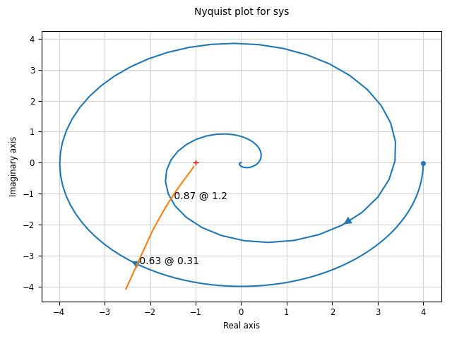

.. currentmodule:: control

.. _descfcn-module:

Describing Functions
====================

For nonlinear systems consisting of a feedback connection between a
linear system and a nonlinearity, it is possible to obtain a
generalization of Nyquist's stability criterion based on the idea of
describing functions.  The basic concept involves approximating the
response of a nonlinearity to an input :math:`u = A e^{j \omega t}` as
an output :math:`y = N(A) (A e^{j \omega t})`, where :math:`N(A) \in
\mathbb{C}` represents the (amplitude-dependent) gain and phase
associated with the nonlinearity.

In the most common case, the nonlinearity will be a static,
time-invariant nonlinear function :math:`y = h(u)`.  However,
describing functions can be defined for nonlinear input/output systems
that have some internal memory, such as hysteresis or backlash.  For
simplicity, we take the nonlinearity to be static (memoryless) in the
description below, unless otherwise specified.

Stability analysis of a linear system :math:`H(s)` with a feedback
nonlinearity :math:`F(x)` is done by looking for amplitudes :math:`A`
and frequencies :math:`\omega` such that

.. math::

   H(j\omega) N(A) = -1

If such an intersection exists, it indicates that there may be a limit
cycle of amplitude :math:`A` with frequency :math:`\omega`.

Describing function analysis is a simple method, but it is approximate
because it assumes that higher harmonics can be neglected.  More
information on describing functions can be found in `Feedback Systems
<https://fbswiki.org/wiki/index.php?title=FBS>`_, Section 10.5
(Generalized Notions of Gain and Phase).

Module usage
------------

The function :func:`describing_function` can be used to
compute the describing function of a nonlinear function::

  N = ct.describing_function(F, A)

where `F` is a scalar nonlinear function.

Stability analysis using describing functions is done by looking for
amplitudes :math:`A` and frequencies :math:`\omega` such that

.. math::

   H(j\omega) = \frac{-1}{N(A)}

These points can be determined by generating a Nyquist plot in which
the transfer function :math:`H(j\omega)` intersects the negative
reciprocal of the describing function :math:`N(A)`.  The
:func:`describing_function_response` function computes the
amplitude and frequency of any points of intersection::

    dfresp = ct.describing_function_response(H, F, amp_range[, omega_range])
    dfresp.intersections	# frequency, amplitude pairs

A Nyquist plot showing the describing function and the intersections
with the Nyquist curve can be generated using ``dfresp.plot()``, which
calls the :func:`describing_function_plot` function.

Pre-defined nonlinearities
--------------------------

To facilitate the use of common describing functions, the following
nonlinearity constructors are predefined:

.. code:: python

  friction_backlash_nonlinearity(b)	# backlash nonlinearity with width b
  relay_hysteresis_nonlinearity(b, c)   # relay output of amplitude b with
					# hysteresis of half-width c
  saturation_nonlinearity(ub[, lb])	# saturation nonlinearity with upper
					# bound and (optional) lower bound

Calling these functions will create an object `F` that can be used for
describing function analysis.  For example, to create a saturation
nonlinearity::

  F = ct.saturation_nonlinearity(1)

These functions use the :class:`DescribingFunctionNonlinearity` class,
which allows an analytical description of the describing function.

Example
-------

The following example demonstrates a more complicated interaction
between a (non-static) nonlinearity and a higher order transfer
function, resulting in multiple intersection points:

.. testcode:: descfcn

  # Linear dynamics
  H_simple = ct.tf([1], [1, 2, 2, 1])
  H_multiple = ct.tf(H_simple * ct.tf(*ct.pade(5, 4)) * 4, name='sys')
  omega = np.logspace(-3, 3, 500)

  # Nonlinearity
  F_backlash = ct.friction_backlash_nonlinearity(1)
  amp = np.linspace(0.6, 5, 50)

  # Describing function plot
  cplt = ct.describing_function_plot(
      H_multiple, F_backlash, amp, omega, mirror_style=False)

.. testcode:: descfcn
  :hide:

  import matplotlib.pyplot as plt
  plt.savefig('figures/descfcn-pade-backlash.png')

Module classes and functions
----------------------------
.. autosummary::
   :template: custom-class-template.rst

   describing_function
   describing_function_response
   describing_function_plot
   DescribingFunctionNonlinearity
   friction_backlash_nonlinearity
   relay_hysteresis_nonlinearity
   saturation_nonlinearity
   ~DescribingFunctionNonlinearity.__call__

