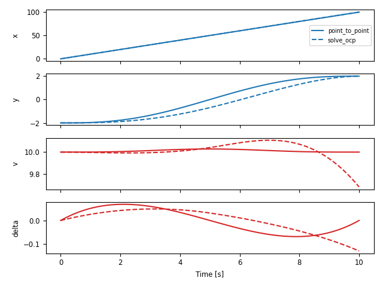

.. currentmodule:: control

.. _flatsys-module:

Differentially Flat Systems
===========================

The `flatsys` sub-package contains a set of classes and functions to
compute trajectories for differentially flat systems.  The objects in
this sub-package must be explictly imported::

  import control as ct
  import control.flatsys as fs

Overview of differential flatness
---------------------------------

A nonlinear differential equation of the form

.. math::

   \dot x = f(x, u), \qquad x \in R^n, u \in R^m

is *differentially flat* if there exists a function :math:`\alpha` such that

.. math::

   z = \alpha(x, u, \dot u\, \dots, u^{(p)})

and we can write the solutions of the nonlinear system as functions of
:math:`z` and a finite number of derivatives

.. math::
   :label: flat2state

   x &= \beta(z, \dot z, \dots, z^{(q)}) \\
   u &= \gamma(z, \dot z, \dots, z^{(q)}).

For a differentially flat system, all of the feasible trajectories for
the system can be written as functions of a flat output :math:`z(\cdot)` and
its derivatives.  The number of flat outputs is always equal to the
number of system inputs.

Differentially flat systems are useful in situations where explicit
trajectory generation is required. Since the behavior of a flat system
is determined by the flat outputs, we can plan trajectories in output
space, and then map these to appropriate inputs.  Suppose we wish to
generate a feasible trajectory for the nonlinear system

.. math::

   \dot x = f(x, u), \qquad x(0) = x_0,\, x(T) = x_f.

If the system is differentially flat then

.. math::

   x(0) &= \beta\bigl(z(0), \dot z(0), \dots, z^{(q)}(0) \bigr) = x_0, \\
   x(T) &= \gamma\bigl(z(T), \dot z(T), \dots, z^{(q)}(T) \bigr) = x_f,

and we see that the initial and final condition in the full state
space depends on just the output :math:`z` and its derivatives at the
initial and final times.  Thus any trajectory for :math:`z` that satisfies
these boundary conditions will be a feasible trajectory for the
system, using equation :eq:`flat2state` to determine the
full state space and input trajectories.

In particular, given initial and final conditions on :math:`z` and its
derivatives that satisfy the initial and final conditions any curve
:math:`z(\cdot)` satisfying those conditions will correspond to a feasible
trajectory of the system.  We can parameterize the flat output trajectory
using a set of smooth basis functions :math:`\psi_i(t)`:

.. math::

   z(t) = \sum_{i=1}^N c_i \psi_i(t), \qquad c_i \in R

We seek a set of coefficients :math:`c_i`, :math:`i = 1, \dots, N` such
that :math:`z(t)` satisfies the boundary conditions for :math:`x(0)` and
:math:`x(T)`.  The derivatives of the flat output can be computed in terms of
the derivatives of the basis functions:

.. math::

   \dot z(t) &= \sum_{i=1}^N c_i \dot \psi_i(t) \\
   &\, \vdots \\
   \dot z^{(q)}(t) &= \sum_{i=1}^N c_i \psi^{(q)}_i(t).

We can thus write the conditions on the flat outputs and their
derivatives as

.. math::

   \begin{bmatrix}
     \psi_1(0) & \psi_2(0) & \dots & \psi_N(0) \\
     \dot \psi_1(0) & \dot \psi_2(0) & \dots & \dot \psi_N(0) \\
     \vdots & \vdots & & \vdots \\
     \psi^{(q)}_1(0) & \psi^{(q)}_2(0) & \dots & \psi^{(q)}_N(0) \\[1ex]
     \psi_1(T) & \psi_2(T) & \dots & \psi_N(T) \\
     \dot \psi_1(T) & \dot \psi_2(T) & \dots & \dot \psi_N(T) \\
     \vdots & \vdots & & \vdots \\
     \psi^{(q)}_1(T) & \psi^{(q)}_2(T) & \dots & \psi^{(q)}_N(T) \\
   \end{bmatrix}
   \begin{bmatrix} c_1 \\ \vdots \\ c_N \end{bmatrix} =
   \begin{bmatrix}
     z(0) \\ \dot z(0) \\ \vdots \\ z^{(q)}(0) \\[1ex]
     z(T) \\ \dot z(T) \\ \vdots \\ z^{(q)}(T) \\
   \end{bmatrix}

This equation is a *linear* equation of the form

.. math::

   M c = \begin{bmatrix} \bar z(0) \\ \bar z(T) \end{bmatrix}

where :math:`\bar z` is called the *flat flag* for the system.
Assuming that :math:`M` has a sufficient number of columns and that it
is full column rank, we can solve for a (possibly non-unique)
:math:`\alpha` that solves the trajectory generation problem.

Sub-package usage
-----------------

To access the flat system modules, import `control.flatsys`::

  import control.flatsys as fs

To create a trajectory for a differentially flat system, a
:class:`~flatsys.FlatSystem` object must be created.  This is done
using the :func:`~flatsys.flatsys` function::

  sys = fs.flatsys(forward, reverse)

The `forward` and `reverse` parameters describe the mappings between
the system state/input and the differentially flat outputs and their
derivatives ("flat flag").  The :func:`~flatsys.FlatSystem.forward`
method computes the flat flag given a state and input::

  zflag = sys.forward(x, u)

The :func:`~flatsys.FlatSystem.reverse` method computes the state
and input given the flat flag::

  x, u = sys.reverse(zflag)

The flag :math:`\bar z` is implemented as a list of flat outputs :math:`z_i`
and their derivatives up to order :math:`q_i`:

  ``zflag[i][j]`` = :math:`z_i^{(j)}`

The number of flat outputs must match the number of system inputs.

For a linear system, a flat system representation can be generated by
passing a :class:`StateSpace` system to the
:func:`~flatsys.flatsys` factory function::

  sys = fs.flatsys(linsys)

The :func:`~flatsys.flatsys` function also supports the use of
named input, output, and state signals::

  sys = fs.flatsys(
      forward, reverse, states=['x1', ..., 'xn'], inputs=['u1', ..., 'um'])

In addition to the flat system description, a set of basis functions
:math:`\phi_i(t)` must be chosen.  The `FlatBasis` class is used to
represent the basis functions.  A polynomial basis function of the
form 1, :math:`t`, :math:`t^2`, ... can be computed using the
:class:`~flatsys.PolyFamily` class, which is initialized by
passing the desired order of the polynomial basis set::

  basis = fs.PolyFamily(N)

Additional basis function families include Bezier curves
(:class:`~flatsys.BezierFamily`) and B-splines
(:class:`~flatsys.BSplineFamily`).

Once the system and basis function have been defined, the
:func:`~flatsys.point_to_point` function can be used to compute a
trajectory between initial and final states and inputs::

  traj = fs.point_to_point(
      sys, Tf, x0, u0, xf, uf, basis=basis)

The returned object has class :class:`~flatsys.SystemTrajectory` and
can be used to compute the state and input trajectory between the initial and
final condition::

  xd, ud = traj.eval(timepts)

where `timepts` is a list of times on which the trajectory should be evaluated
(e.g., `timepts = numpy.linspace(0, Tf, M)`.

The :func:`~flatsys.point_to_point` function also allows the
specification of a cost function and/or constraints, in the same
format as :func:`optimal.solve_ocp`.

The :func:`~flatsys.solve_flat_ocp` function can be used to solve an
optimal control problem for a differentially flat system without a
final state constraint::

  traj = fs.solve_flat_ocp(
      sys, timepts, x0, u0, cost, basis=basis)

The `cost` parameter is a function with call signature
`cost(x, u)` and should return the (incremental) cost at the given
state, and input.  It will be evaluated at each point in the `timepts`
vector.  The `terminal_cost` parameter can be used to specify a cost
function for the final point in the trajectory.

Example
-------

To illustrate how we can differential flatness to generate a feasible
trajectory, consider the problem of steering a car to change lanes on
a road. We use the non-normalized form of the dynamics, which are
derived in `Feedback Systems
<https://fbswiki.org/wiki/index.php?title=FBS>`, Example 3.11 (Vehicle
Steering).

.. testsetup:: flatsys

    import matplotlib.pyplot as plt
    plt.close('all')

.. testcode:: flatsys

    import numpy as np
    import control as ct
    import control.flatsys as fs

    # Function to take states, inputs and return the flat flag
    def vehicle_flat_forward(x, u, params={}):
        # Get the parameter values
        b = params.get('wheelbase', 3.)

        # Create a list of arrays to store the flat output and its derivatives
        zflag = [np.zeros(3), np.zeros(3)]

        # Flat output is the x, y position of the rear wheels
        zflag[0][0] = x[0]
        zflag[1][0] = x[1]

        # First derivatives of the flat output
        zflag[0][1] = u[0] * np.cos(x[2])  # dx/dt
        zflag[1][1] = u[0] * np.sin(x[2])  # dy/dt

        # First derivative of the angle
        thdot = (u[0]/b) * np.tan(u[1])

        # Second derivatives of the flat output (setting vdot = 0)
        zflag[0][2] = -u[0] * thdot * np.sin(x[2])
        zflag[1][2] =  u[0] * thdot * np.cos(x[2])

        return zflag

    # Function to take the flat flag and return states, inputs
    def vehicle_flat_reverse(zflag, params={}):
        # Get the parameter values
        b = params.get('wheelbase', 3.)

        # Create a vector to store the state and inputs
        x = np.zeros(3)
        u = np.zeros(2)

        # Given the flat variables, solve for the state
        x[0] = zflag[0][0]  # x position
        x[1] = zflag[1][0]  # y position
        x[2] = np.arctan2(zflag[1][1], zflag[0][1])  # tan(theta) = ydot/xdot

        # And next solve for the inputs
        u[0] = zflag[0][1] * np.cos(x[2]) + zflag[1][1] * np.sin(x[2])
        u[1] = np.arctan2(
            (zflag[1][2] * np.cos(x[2]) - zflag[0][2] * np.sin(x[2])), u[0]/b)

        return x, u

    def vehicle_update(t, x, u, params):
        b = params.get('wheelbase', 3.)             # get parameter values
        dx = np.array([
            np.cos(x[2]) * u[0],
            np.sin(x[2]) * u[0],
            (u[0]/b) * np.tan(u[1])
        ])
        return dx

    vehicle_flat = fs.flatsys(
        vehicle_flat_forward, vehicle_flat_reverse,
	updfcn=vehicle_update, outfcn=None, name='vehicle_flat',
	inputs=('v', 'delta'), outputs=('x', 'y'), states=('x', 'y', 'theta'))

To find a trajectory from an initial state :math:`x_0` to a final
state :math:`x_\text{f}` in time :math:`T_\text{f}` we solve a
point-to-point trajectory generation problem. We also set the initial
and final inputs, which sets the vehicle velocity :math:`v` and
steering wheel angle :math:`\delta` at the endpoints.

.. testcode:: flatsys

    # Define the endpoints of the trajectory
    x0 = [0., -2., 0.]; u0 = [10., 0.]
    xf = [100., 2., 0.]; uf = [10., 0.]
    Tf = 10

    # Define a set of basis functions to use for the trajectories
    poly = fs.PolyFamily(6)

    # Find a trajectory between the initial condition and the final condition
    traj = fs.point_to_point(vehicle_flat, Tf, x0, u0, xf, uf, basis=poly)

    # Create the trajectory
    timepts = np.linspace(0, Tf, 100)
    xd, ud = traj.eval(timepts)
    resp_p2p = ct.input_output_response(vehicle_flat, timepts, ud, X0=xd[:, 0])

Alternatively, we can solve an optimal control problem in which we
minimize a cost function along the trajectory as well as a terminal
cost:

.. testcode:: flatsys

    # Define the cost along the trajectory: penalize steering angle
    traj_cost = ct.optimal.quadratic_cost(
        vehicle_flat, None, np.diag([0.1, 10]), u0=uf)

    # Define the terminal cost: penalize distance from the end point
    term_cost = ct.optimal.quadratic_cost(
        vehicle_flat, np.diag([1e3, 1e3, 1e3]), None, x0=xf)

    # Use a straight line as the initial guess
    evalpts = np.linspace(0, Tf, 10)
    initial_guess = np.array(
        [x0[i] + (xf[i] - x0[i]) * evalpts/Tf for i in (0, 1)])

    # Solve the optimal control problem, evaluating cost at timepts
    bspline = fs.BSplineFamily([0, Tf/2, Tf], 4)
    traj = fs.solve_flat_ocp(
        vehicle_flat, evalpts, x0, u0, traj_cost,
	terminal_cost=term_cost, initial_guess=initial_guess, basis=bspline)

    xd, ud = traj.eval(timepts)
    resp_ocp = ct.input_output_response(vehicle_flat, timepts, ud, X0=xd[:, 0])

The results of the two approaches can be shown using the
`time_response_plot` function:

.. testcode:: flatsys

    cplt = ct.time_response_plot(
        ct.combine_time_responses([resp_p2p, resp_ocp]),
        overlay_traces=True, trace_labels=['point_to_point', 'solve_ocp'])

.. testcode:: flatsys
   :hide:

   import matplotlib.pyplot as plt
   plt.savefig('figures/flatsys-steering-compare.png')

Sub-package classes and functions
---------------------------------

The flat systems sub-package `flatsys` utilizes a number of classes to
define the flatsystem, the basis functions, and the system trajetory:

.. autosummary::
   :template: custom-class-template.rst

   flatsys.BasisFamily
   flatsys.BezierFamily
   flatsys.BSplineFamily
   flatsys.FlatSystem
   flatsys.LinearFlatSystem
   flatsys.PolyFamily
   flatsys.SystemTrajectory

The following functions can be used to define a flat system and
compute trajectories:

.. autosummary::

   flatsys.flatsys
   flatsys.point_to_point
   flatsys.solve_flat_ocp
