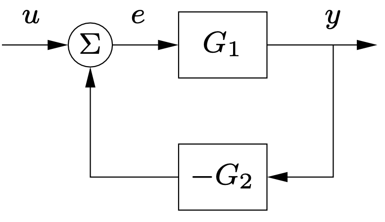
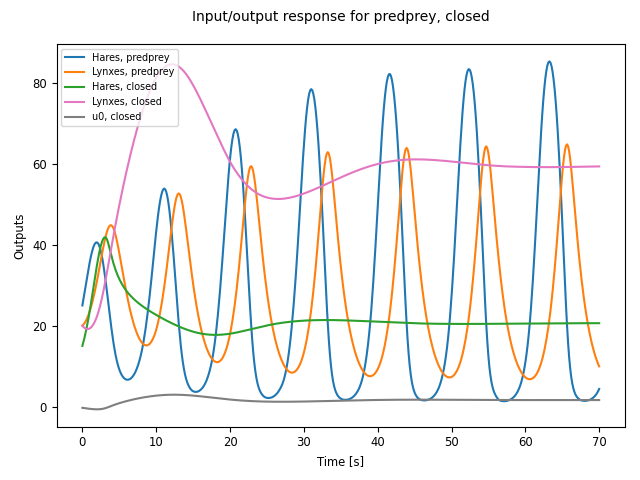

.. currentmodule:: control

.. _iosys-module:

**************************
Interconnected I/O Systems
**************************

Input/output systems can be interconnected in a variety of ways,
including operator overloading, block diagram algebra functions, and
using the :func:`interconnect` function to build a hierarchical system
description.  This chapter provides more detailed information on
operator overloading and block diagram algebra, as well as a
description of the :class:`InterconnectedSystem` class, which can be
created using the :func:`interconnect` function.

Operator Overloading
====================

The following operators are defined to operate between I/O systems:

.. list-table::
   :header-rows: 1

   * - Operation
     - Description
     - Equivalent command
   * - ``sys1 + sys2``
     - Add the outputs of two systems receiving the same input
     - ``parallel(sys1, sys2)``
   * - ``sys1 * sys2``
     - Connect output(s) of sys2 to input(s) of sys1
     - ``series(sys2, sys1)``
   * - ``-sys``
     - Multiply the output(s) of the system by -1
     - ``negate(sys)``
   * - ``tf1 / tf2``
     - Divide one SISO transfer function by another
     - N/A
   * - ``tf**n``
     - Multiply a transfer function by itself ``n`` times
     - N/A

If either of the systems is a scalar or an array of appropriate
dimension, then the appropriate scalar or matrix operation is
performed.

Systems of different types can be combined using these operations,
with the following rules:

* If both systems can be converted into the type of the other, the
  leftmost system determines the type of the output.

* If only one system can be converted into the other, then the more general
  system determines the type of the output.  In particular:

    - State space and transfer function systems can be converted to
      nonlinear systems.

    - Linear systems can be converted to frequency response data (FRD)
      systems, using the frequencies of the FRD system.

    - FRD systems can only be combined with FRD systems, constants,
      and arrays.

Block Diagram Algebra
=====================

Block diagram algebra is implemented using the following functions:

.. autosummary::

   series
   parallel
   feedback
   negate
   append

The :func:`feedback` function implements a standard feedback
interconnection between two systems, as illustrated in the following
diagram:

By default a gain of -1 is applied at the output of the second system,
so the dynamics illustrate above can be created using the command

.. code::

   Gyu = ct.feedback(G1, G2)

An optional `gain` parameter can be used to change the sign of the gain.

The :func:`feedback` function is also implemented via the
:func:`LTI.feedback` method, so if `G1` is an input/output system then
the following command will also work::

  Gyu = G1.feedback(G2)

All block diagram algebra functions allow the names of the system and
signals to be specified using the usual `name`, `inputs`, and
`outputs` keywords, as described in the :class:`InputOutputSystem`
class.  For state space systems, the names of the states can also be
given, but caution should be used since the order of states in the
combined system is not guaranteed.

Signal-Based Interconnection
============================

More complex input/output systems can be constructed by using the
:func:`interconnect` function, which allows a collection of
input/output subsystems to be combined with internal connections
between the subsystems and a set of overall system inputs and outputs
that link to the subsystems.  For example, the closed loop dynamics of
a feedback control system using the standard names and labels for
inputs and outputs could be constructed using the command

.. code::

    clsys = ct.interconnect(
        [plant, controller], name='system',
        connections=[
	    ['controller.u', '-plant.y'],
	    ['plant.u', 'controller.y']],
        inplist=['controller.u'], inputs='r',
        outlist=['plant.y'], outputs='y')

The remainder of this section provides a detailed description of the
operation of the :func:`interconnect` function.

Illustrative example
--------------------

To illustrate the use of the :func:`interconnect` function, we create a
model for a predator/prey system, following the notation and parameter
values in `Feedback Systems <http://fbsbook.org>`_.

We begin by defining the dynamics of the system:

.. testsetup:: predprey

   import matplotlib.pyplot as plt
   plt.close('all')

.. testcode:: predprey

  import matplotlib.pyplot as plt
  import numpy as np
  import control as ct

  def predprey_rhs(t, x, u, params):
      # Parameter setup
      a = params.get('a', 3.2)
      b = params.get('b', 0.6)
      c = params.get('c', 50.)
      d = params.get('d', 0.56)
      k = params.get('k', 125)
      r = params.get('r', 1.6)

      # Map the states into local variable names
      H = x[0]
      L = x[1]

      # Compute the control action (only allow addition of food)
      u_0 = u[0] if u[0] > 0 else 0

      # Compute the discrete updates
      dH = (r + u_0) * H * (1 - H/k) - (a * H * L)/(c + H)
      dL = b * (a * H *  L)/(c + H) - d * L

      return np.array([dH, dL])

We now create an input/output system using these dynamics:

.. testcode:: predprey

  predprey = ct.nlsys(
      predprey_rhs, None, inputs=['u'], outputs=['Hares', 'Lynxes'],
      states=['H', 'L'], name='predprey')

Note that since we have not specified an output function, the entire state
will be used as the output of the system.

The `predprey` system can now be simulated to obtain the open loop
dynamics of the system:

.. testcode:: predprey

  X0 = [25, 20]                      # Initial H, L
  timepts = np.linspace(0, 70, 500)  # Simulation 70 years of time

  # Simulate the system and plots the results
  resp = ct.input_output_response(predprey, timepts, 0, X0)
  resp.plot(plot_inputs=False, overlay_signals=True, legend_loc='upper left')

.. testcode:: predprey
   :hide:

   plt.savefig('figures/iosys-predprey-open.png')

.. image:: figures/iosys-predprey-open.png
   :align: center

We can also create a feedback controller to stabilize a desired population of
the system.  We begin by finding the (unstable) equilibrium point for the
system and computing the linearization about that point.

.. testcode:: predprey

  xeq, ueq = ct.find_operating_point(predprey, X0, 0)
  lin_predprey = ct.linearize(predprey, xeq, ueq)

We next compute a controller that stabilizes the equilibrium point using
eigenvalue placement and computing the feedforward gain using the number of
lynxes as the desired output (following `Feedback Systems
<http://fbsbook.org>`_, Example 7.5):

.. testcode:: predprey

  K = ct.place(lin_predprey.A, lin_predprey.B, [-0.1, -0.2])
  A, B = lin_predprey.A, lin_predprey.B
  C = np.array([[0, 1]])                # regulated output = number of lynxes
  kf = -1/(C @ np.linalg.inv(A - B @ K) @ B)

To construct the control law, we build a simple input/output system that
applies a corrective input based on deviations from the equilibrium point.
This system has no dynamics, since it is a static (affine) map, and can
constructed using :func:`nlsys` with no update function:

.. testcode:: predprey

  controller = ct.nlsys(
    None,
    lambda t, x, u, params: -K @ (u[1:] - xeq) + kf * (u[0] - ueq),
    inputs=['Ld', 'H', 'L'], outputs=1, name='control')

The input to the controller is `u`, consisting of the desired lynx
population followed by the vector of hare and lynx populations.

To connect the controller to the predatory-prey model, we use the
:func:`interconnect` function:

.. testcode:: predprey

  closed = ct.interconnect(
    [predprey, controller],	# systems
    connections=[
      ['predprey.u', 'control.y[0]'],
      ['control.H',  'predprey.Hares'],
      ['control.L',  'predprey.Lynxes']
    ],
    inplist=['control.Ld'], inputs='Ld',
    outlist=['predprey.Hares', 'predprey.Lynxes', 'control.y[0]'],
    outputs=['Hares', 'Lynxes', 'u0'], name='closed'
  )

Finally, we simulate the closed loop system:

.. testcode:: predprey

  # Simulate the system
  resp = ct.input_output_response(closed, timepts, 30, [15, 20])
  resp.plot(plot_inputs=False, overlay_signals=True, legend_loc='upper left')

.. testcode:: predprey
   :hide:

   plt.savefig('figures/iosys-predprey-closed.png')

This example shows the standard operations that would be used to build
up an interconnected nonlinear system.  The I/O systems module has a
number of other features that can be used to simplify the creation and
use of interconnected input/output systems.

Summing junction
----------------

The :func:`summing_junction` function can be used to create an
input/output system that takes the sum of an arbitrary number of inputs.  For
example, to create an input/output system that takes the sum of three inputs,
use the command

.. testcode:: summing

  sumblk = ct.summing_junction(3)

By default, the name of the inputs will be of the form 'u[i]' and the output
will be 'y'.  This can be changed by giving an explicit list of names:

.. testcode:: summing

  sumblk = ct.summing_junction(inputs=['a', 'b', 'c'], output='d')

A more typical usage would be to define an input/output system that
compares a reference signal to the output of the process and computes
the error:

.. testcode:: summing

  sumblk = ct.summing_junction(inputs=['r', '-y'], output='e')

Note the use of the minus sign as a means of setting the sign of the
input 'y' to be negative instead of positive.

It is also possible to define "vector" summing blocks that take
multi-dimensional inputs and produce a multi-dimensional output.  For
example, the command

.. testcode:: summing

  sumblk = ct.summing_junction(inputs=['r', '-y'], output='e', dimension=2)

will produce an input/output block that implements ``e[0] = r[0] - y[0]`` and
``e[1] = r[1] - y[1]``.

Automatic connections using signal names
----------------------------------------

The :func:`interconnect` function allows the interconnection of
multiple systems by using signal names of the form 'sys.signal'.  In many
situations, it can be cumbersome to explicitly connect all of the appropriate
inputs and outputs.  As an alternative, if the `connections` keyword is
omitted, the :func:`interconnect` function will connect all signals
of the same name to each other.  This can allow for simplified methods of
interconnecting systems, especially when combined with the
:func:`summing_junction` function.  For example, the following code
will create a unity gain, negative feedback system:

.. testcode: autoconnect

  P = ct.tf([1], [1, 0], inputs='u', outputs='y')
  C = ct.tf([10], [1, 1], inputs='e', outputs='u')
  sumblk = ct.summing_junction(inputs=['r', '-y'], output='e')
  T = ct.interconnect([P, C, sumblk], inplist='r', outlist='y')

If a signal name appears in multiple outputs then that signal will be summed
when it is interconnected.  Similarly, if a signal name appears in multiple
inputs then all systems using that signal name will receive the same input.
The :func:`interconnect` function will generate an error if a signal
listed in `inplist` or `outlist` (corresponding to the inputs and outputs
of the interconnected system) is not found, but inputs and outputs of
individual systems that are not connected to other systems are left
unconnected (so be careful!).

Vector element processing
--------------------------

Several I/O system commands perform processing of vector elements
(such as initial states or input vectors) and broadcast these to the
proper shape.

For static elements, such as the initial state in a simulation or the
nominal state and input for a linearization, the following processing
is done:

* Scalars are automatically converted to a vector of the appropriate
  size consisting of the scalar value. This is commonly used when
  specifying the origin ('0') or a step input ('1').

* Lists of values are concatenated into a single vector.  This is
  often used when you have an interconnected system and you need to
  specify the initial condition or input value for each subsystem
  (e.g., [X1eq, X2eq, ...]).

* Vector elements are zero padded to the required length. If you
  specify only a portion of the values for states or inputs, the
  remaining values are taken as zero.  (If the final element in the
  given vector is non-zero, a warning is issued.)

Similar processing is done for input time series, used for the
:func:`input_output_response` and
:func:`forced_response` commands, with the following
additional feature:

* Time series elements are broadcast to match the number of time points
  specified.  If a list of time series and static elements are given (as a
  list), static elements are broadcast to the proper number of time points,
  and the overall list of elements concatenated to provide the full input
  vector.

As an example, suppose we have an interconnected system consisting of three
subsystems, a controlled process, an estimator, and a (static) controller::

  proc = ct.nlsys(...,
      states=2, inputs=['u1', 'u2', 'd'], outputs='y')
  estim = ct.nlsys(...,
      states=2, inputs='y', outputs=['xhat[0]', 'xhat[1]')
  ctrl = ct.nlsys(...,
      states=0, inputs=['r', 'xhat[0]', 'xhat[1]'], outputs=['u1', 'u2'])

  clsys = ct.interconnect(
      [proc, estim, ctrl], inputs=['r', 'd'], outputs=['y', 'u1', 'u2'])

To linearize the system around the origin, we can utilize the scalar
processing feature of vector elements::

  P = proc.linearize(0, 0)

In this command, the states and the inputs are broadcast to the size of the
state and input vectors, respectively.

If we want to linearize the closed loop system around a process state
`x0` (with two elements) and an estimator state `0` (for both states),
we can use the list processing feature::

  H = clsys.linearize([x0, 0], 0)

Note that this also utilizes the zero-padding functionality, since the
second argument in the list ``[x0, 0]`` is a scalar and so the vector
``[x0, 0]`` only has three elements instead of the required four.

To run an input/output simulation with a sinusoidal signal for the first
input, a constant for the second input, and no external disturbance, we can
use the list processing feature combined with time series broadcasting::

  timepts = np.linspace(0, 10)
  u1 = np.sin(timepts)
  u2 = 1
  resp = ct.input_output_response(clsys, timepts, [u1, u2, 0])

In this command, the second and third arguments will be broadcast to match
the number of time points.

Advanced specification of signal names
--------------------------------------

In addition to manual specification of signal names and automatic
connection of signals with the same name, the
:func:`interconnect` has a variety of other mechanisms
available for specifying signal names.  The following forms are
recognized for the `connections`, `inplist`, and `outlist`
parameters::

  (subsys, index, gain)             tuple form with integer indices
  ('sysname', 'signal', gain)	    tuple form with name lookup
  'sysname.signal[i]'		    string form (gain = 1)
  '-sysname.signal[i]'		    set gain to -1
  (subsys, [i1, ..., iN], gain)     signals with indices i1, ..., in
  'sysname.signal[i:j]'             range of signal names, i through j-1
  'sysname'			    all input or outputs of system
  'signal'			    all matching signals (in any subsystem)

For tuple forms, mixed specifications using integer indices and
strings are possible.

For the index range form ``sysname.signal[i:j]``, if either `i` or `j`
is not specified, then it defaults to the minimum or maximum value of
the signal range.  Note that despite the similarity to slice notation,
negative indices and step specifications are not supported.

Using these various forms can simplify the specification of
interconnections.  For example, consider a process with inputs 'u' and
'v', each of dimension 2, and two outputs 'w' and 'y', each of
dimension 2:

.. testcode:: interconnect

   P = ct.ss(
       np.diag([-1, -2, -3, -4]), np.eye(4), np.eye(4), 0, name='P',
       inputs=['u[0]', 'u[1]', 'v[0]', 'v[1]'],
       outputs=['y[0]', 'y[1]', 'z[0]', 'z[1]'])

Suppose we construct a controller with 2 inputs and 2 outputs that
takes the (2-dimensional) error 'e' and outputs and control signal 'u':

.. testcode:: interconnect

   C = ct.ss(
       [], [], [], [[3, 0], [0, 4]],
       name='C', input_prefix='e', output_prefix='u')

Finally, we include a summing block that will take the difference between
the reference input 'r' and the measured output 'y':

.. testcode:: interconnect

  sumblk = ct.summing_junction(
    inputs=['r', '-y'], outputs='e', dimension=2, name='sum')

The closed loop system should close the loop around the process
outputs 'y' and inputs 'u', leaving the process inputs 'v' and outputs
'w', as well as the reference input 'r'.  We would like the output of
the closed loop system to consist of all system outputs 'y' and 'z',
as well as the controller input 'u'.

This collection of systems can be combined in a variety of ways.  The
most explicit would specify every signal:

.. testcode:: interconnect

  clsys1 = ct.interconnect(
    [C, P, sumblk],
    connections=[
      ['P.u[0]', 'C.u[0]'], ['P.u[1]', 'C.u[1]'],
      ['C.e[0]', 'sum.e[0]'], ['C.e[1]', 'sum.e[1]'],
      ['sum.y[0]', 'P.y[0]'], ['sum.y[1]', 'P.y[1]'],
    ],
    inplist=['sum.r[0]', 'sum.r[1]', 'P.v[0]', 'P.v[1]'],
    outlist=['P.y[0]', 'P.y[1]', 'P.z[0]', 'P.z[1]', 'C.u[0]', 'C.u[1]']
  )

This connections can be simplified using signal ranges:

.. testcode:: interconnect

  clsys2 = ct.interconnect(
    [C, P, sumblk],
    connections=[
      ['P.u[0:2]', 'C.u[0:2]'],
      ['C.e[0:2]', 'sum.e[0:2]'],
      ['sum.y[0:2]', 'P.y[0:2]']
    ],
    inplist=['sum.r[0:2]', 'P.v[0:2]'],
    outlist=['P.y[0:2]', 'P.z[0:2]', 'C.u[0:2]']
  )

An even simpler form can be used by omitting the range specification
when all signals with the same prefix are used:

.. testcode:: interconnect

  clsys3 = ct.interconnect(
    [C, P, sumblk],
    connections=[['P.u', 'C.u'], ['C.e', 'sum.e'], ['sum.y', 'P.y']],
    inplist=['sum.r', 'P.v'], outlist=['P.y', 'P.z', 'C.u']
  )

A further simplification is possible when all of the inputs or outputs
of an individual system are used in a given specification:

.. testcode:: interconnect

  clsys4 = ct.interconnect(
    [C, P, sumblk], name='clsys4',
    connections=[['P.u', 'C'], ['C', 'sum'], ['sum.y', 'P.y']],
    inplist=['sum.r', 'P.v'], outlist=['P', 'C.u']
  )

And finally, since we have named the signals throughout the system in a
consistent way, we could let :func:`interconnect` do all of the
work:

.. testcode:: interconnect

  clsys5 = ct.interconnect(
    [C, P, sumblk], inplist=['sum.r', 'P.v'], outlist=['P', 'C.u']
  )

Various other simplifications are possible, but it can sometimes be
complicated to debug error message when things go wrong.  Setting
`debug` = True when calling :func:`interconnect` prints out
information about how the arguments are processed that may be helpful
in understanding what is going wrong.

If the system is constructed successfully but the system does not seem
to behave correctly, the `print` function can be used to show the
interconnections and outputs:

.. doctest:: interconnect

    >>> print(clsys4)
    <LinearICSystem>: clsys4
    Inputs (4): ['u[0]', 'u[1]', 'u[2]', 'u[3]']
    Outputs (6): ['y[0]', 'y[1]', 'y[2]', 'y[3]', 'y[4]', 'y[5]']
    States (4): ['P_x[0]', 'P_x[1]', 'P_x[2]', 'P_x[3]']
    <BLANKLINE>
    Subsystems (3):
     * <StateSpace C: ['e[0]', 'e[1]'] -> ['u[0]', 'u[1]'], dt=None>
     * <StateSpace P: ['u[0]', 'u[1]', 'v[0]', 'v[1]'] -> ['y[0]', 'y[1]', 'z[0]',
        'z[1]']>
     * <StateSpace sum: ['r[0]', 'r[1]', 'y[0]', 'y[1]'] -> ['e[0]', 'e[1]'],
        dt=None>
    <BLANKLINE>
    Connections:
     * C.e[0] <- sum.e[0]
     * C.e[1] <- sum.e[1]
     * P.u[0] <- C.u[0]
     * P.u[1] <- C.u[1]
     * P.v[0] <- u[2]
     * P.v[1] <- u[3]
     * sum.r[0] <- u[0]
     * sum.r[1] <- u[1]
     * sum.y[0] <- P.y[0]
     * sum.y[1] <- P.y[1]
    <BLANKLINE>
    Outputs:
     * y[0] <- P.y[0]
     * y[1] <- P.y[1]
     * y[2] <- P.z[0]
     * y[3] <- P.z[1]
     * y[4] <- C.u[0]
     * y[5] <- C.u[1]
    <BLANKLINE>
    A = [[-4.  0.  0.  0.]
         [ 0. -6.  0.  0.]
         [ 0.  0. -3.  0.]
         [ 0.  0.  0. -4.]]
    <BLANKLINE>
    B = [[3. 0. 0. 0.]
         [0. 4. 0. 0.]
         [0. 0. 1. 0.]
         [0. 0. 0. 1.]]
    <BLANKLINE>
    C = [[ 1.  0.  0.  0.]
         [ 0.  1.  0.  0.]
         [ 0.  0.  1.  0.]
         [ 0.  0.  0.  1.]
         [-3.  0.  0.  0.]
         [ 0. -4.  0.  0.]]
    <BLANKLINE>
    D = [[0. 0. 0. 0.]
         [0. 0. 0. 0.]
         [0. 0. 0. 0.]
         [0. 0. 0. 0.]
         [3. 0. 0. 0.]
         [0. 4. 0. 0.]]

Automated creation of state feedback systems
============================================

A common architecture in state space feedback control is to use a
linear control law to stabilize a system around a trajectory.  The
python-control package can create input/output systems that help
implement this architecture.

Standard design patterns
------------------------

The :func:`create_statefbk_iosystem` function can be used to create an
I/O system consisting of a state feedback gain (with optional integral
action and gain scheduling) and an estimator.  A basic state feedback
controller of the form

.. math::

  u = u_\text{d} - K (x - x_\text{d})

can be created with the command::

  ctrl, clsys = ct.create_statefbk_iosystem(sys, K)

where `sys` is the process dynamics and `K` is the state feedback gain
(e.g., from LQR).  The function returns the controller `ctrl` and the
closed loop systems `clsys`, both as I/O systems.  The input to the
controller is the vector of desired states :math:`x_\text{d}`, desired
inputs :math:`u_\text{d}`, and system states :math:`x`.

The above design pattern is referred to as the "trajectory generation"
('trajgen') pattern, since it assumes that the input to the controller is a
feasible trajectory :math:`(x_\text{d}, u_\text{d})`.  Alternatively, a
controller using the "reference gain" pattern can be created, which
implements a state feedback controller of the form

.. math::

  u = k_\text{f}\, r - K x,

where :math:`r` is the reference input and :math:`k_\text{f}` is the
feedforward gain (normally chosen so that the steady state output
:math:`y_\text{ss}` will be equal to :math:`r`).

A reference gain controller can be created with the command::

  ctrl, clsys = ct.create_statefbk_iosystem(
      sys, K, kf, feedfwd_pattern='refgain')

This reference gain design pattern is described in more detail in
`Feedback Systems <http://fbsbook.org>`_, Section 7.2 (Stabilization
by State Feedback) and the trajectory generation design pattern is
described in Section 8.5 (State Space Controller Design).

Adding state estimation
-----------------------

.. todo::
   Add `create_estimator_iosystem`

If the full system state is not available, the output of a state
estimator can be used to construct the controller using the command::

  ctrl, clsys = ct.create_statefbk_iosystem(sys, K, estimator=estim)

where `estim` is the state estimator I/O system.  The controller will
have the same form as above, but with the system state :math:`x`
replaced by the estimated state :math:`\hat x` (output of `estim`).
The closed loop controller will include both the state feedback and
the estimator.

Adding integral action
----------------------

Integral action can be included using the `integral_action` keyword.
The value of this keyword can either be a matrix (ndarray) or a
function.  If a matrix :math:`C` is specified, the difference between
the desired state and system state will be multiplied by this matrix
and integrated.  The controller gain should then consist of a set of
proportional gains :math:`K_\text{p}` and integral gains
:math:`K_\text{i}` with

.. math::

   K = \begin{bmatrix} K_\text{p} \\ K_\text{i} \end{bmatrix}

and the control action will be given by

.. math::

  u = u_\text{d} - K\text{p} (x - x_\text{d}) -
      K_\text{i} \int C (x - x_\text{d}) dt.

If `integral_action` is a function ``h``, that function will be called
with the signature ``h(t, x, u, params)`` to obtain the outputs that
should be integrated.  The number of outputs that are to be integrated
must match the number of additional columns in the `K` matrix.  If an
estimator is specified, :math:`\hat x` will be used in place of
:math:`x`.

Adding gain scheduling
----------------------

Finally, for the trajectory generation design pattern, gain scheduling on
the desired state, desired input, or system state can be implemented by
setting the gain to a 2-tuple consisting of a list of gains and a list of
points at which the gains were computed, as well as a description of the
scheduling variables::

  ctrl, clsys = ct.create_statefbk_iosystem(
      sys, ([g1, ..., gN], [p1, ..., pN]), gainsched_indices=[s1, ..., sq])

The list of indices can either be integers indicating the offset into
the controller input vector :math:`(x_\text{d}, u_\text{d}, x)` or a
list of strings matching the names of the input signals.  The
controller implemented in this case has the form

.. math::

  u = u_\text{d} - K(\mu) (x - x_\text{d})

where :math:`\mu` represents the scheduling variables.  See
:ref:`steering-gainsched.py` for an example implementation of a gain
scheduled controller (in the alternative formulation section at the
bottom of the file).

Integral action and state estimation can also be used with gain
scheduled controllers.

.. todo::
   Add example?
