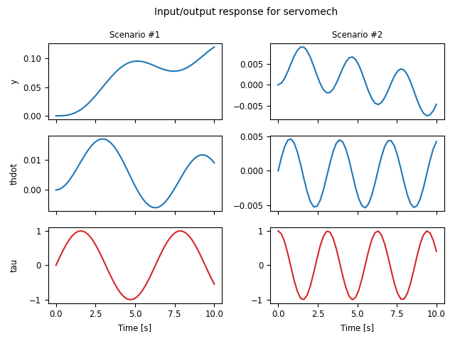

.. currentmodule:: control

Nonlinear System Models
=======================

Nonlinear input/output systems are represented as state space systems
of the form

.. math::

   \frac{dx}{dt} &= f(t, x, u, \theta), \\
   y &= h(t, x, u, \theta),

where :math:`t` represents the current time, :math:`x` is the system
state, :math:`u` is the system input, :math:`y` is the system output,
and :math:`\theta` represents a set of parameters.

Discrete time systems are also supported and have dynamics of the form

.. math::

   x[t+1] &= f(t, x[t], u[t], \theta), \\
   y[t] &= h(t, x[t], u[t], \theta).

.. _sec-nonlinear-models:

Creating nonlinear models
-------------------------

A nonlinear system is created using the :func:`nlsys` factory function::

  sys = ct.nlsys(
      updfcn[, outfcn], inputs=m, states=n, outputs=p, [, params=params])

The `updfcn` argument is a function returning the state update function::

  updfcn(t, x, u, params) -> array

where `x` is a 1-D array with shape (n,), `u` is a 1-D array
with shape (m,), `t` is a float representing the current time,
and `params` is a dict containing the values of parameters used by the
function.  The dynamics of the system can be in continuous or discrete
time (use the `dt` keyword to create a discrete-time system).

The output function `outfcn` is used to specify the outputs of the
system and has the same calling signature as `updfcn`.  If it is not
specified, then the output of the system is set equal to the system
state.  Otherwise, it should return an array of shape (p,).

Note that the number of states, inputs, and outputs should generally
be explicitly specified, although some operations can infer the
dimensions if they are not given when the system is created.  The
`inputs`, `outputs`, and `states` keywords can also be given as lists
of strings, in which case the various signals will be given the
appropriate names.

To illustrate the creation of a nonlinear I/O system model, consider a
simple model of a spring loaded arm driven by a motor:

.. image:: figures/servomech-diagram.png
   :width: 240
   :align: center

The dynamics of this system can be modeling using the following code:

.. testcode::

  # Parameter values
  servomech_params = {
      'J': 100,             # Moment of inertia of the motor
      'b': 10,              # Angular damping of the arm
      'k': 1,               # Spring constant
      'r': 1,               # Location of spring contact on arm
      'l': 2,               # Distance to the read head
      'eps': 0.01,          # Magnitude of velocity-dependent perturbation
  }

  # State derivative
  def servomech_update(t, x, u, params):
      # Extract the configuration and velocity variables from the state vector
      theta = x[0]                # Angular position of the disk drive arm
      thetadot = x[1]             # Angular velocity of the disk drive arm
      tau = u[0]                  # Torque applied at the base of the arm

      # Get the parameter values
      J, b, k, r = map(params.get, ['J', 'b', 'k', 'r'])

      # Compute the angular acceleration
      dthetadot = 1/J * (
          -b * thetadot - k * r * np.sin(theta) + tau)

      # Return the state update law
      return np.array([thetadot, dthetadot])

  # System output (tip radial position + angular velocity)
  def servomech_output(t, x, u, params):
      l = params['l']
      return np.array([l * x[0], x[1]])

  # System dynamics
  servomech = ct.nlsys(
      servomech_update, servomech_output, name='servomech',
      params=servomech_params, states=['theta', 'thdot'],
      outputs=['y', 'thdot'], inputs=['tau'])

A summary of the model can be obtained using the string representation
of the model (via the Python `~python.print` function):

.. doctest::

  >>> print(servomech)
  <NonlinearIOSystem>: servomech
  Inputs (1): ['tau']
  Outputs (2): ['y', 'thdot']
  States (2): ['theta', 'thdot']
  Parameters: ['J', 'b', 'k', 'r', 'l', 'eps']
  <BLANKLINE>
  Update: <function servomech_update at ...>
  Output: <function servomech_output at ...>

Operating points and linearization
----------------------------------

A nonlinear input/output system can be linearized around an equilibrium point
to obtain a :class:`StateSpace` linear system::

  sys_ss = ct.linearize(sys_nl, xeq, ueq)

If the equilibrium point is not known, the
:func:`find_operating_point` function can be used to obtain an
equilibrium point. In its simplest form, `find_operating_point` finds
an equilibrium point given either the desired input or desired
output::

  xeq, ueq = find_operating_point(sys, x0, u0)
  xeq, ueq = find_operating_point(sys, x0, u0, y0)

The first form finds an equilibrium point for a given input `u0` based
on an initial guess `x0`.  The second form fixes the desired output
values `y0` and uses `x0` and `u0` as an initial guess to find the
equilibrium point.  If no equilibrium point can be found, the function
returns the operating point that minimizes the state update (state
derivative for continuous-time systems, state difference for discrete
time systems).

More complex operating points can be found by specifying which states,
inputs, or outputs should be used in computing the operating point, as
well as desired values of the states, inputs, outputs, or state
updates.  See the :func:`find_operating_point` documentation for more
details.

Simulations and plotting
------------------------

To simulate an input/output system, use the
:func:`input_output_response` function::

  resp = ct.input_output_response(sys_nl, timepts, U, x0, params)
  t, y, x = resp.time, resp.outputs, resp.states

Time responses can be plotted using the :func:`time_response_plot`
function or (equivalently) the :func:`TimeResponseData.plot`
method::

  cplt = ct.time_response_plot(resp)

The resulting :class:`ControlPlot` object can be used to access
different plot elements:

* `cplt.lines`: Array of `matplotlib.lines.Line2D` objects for each
  line in the plot.  The shape of the array matches the subplots shape
  and the value of the array is a list of Line2D objects in that
  subplot.

* `cplt.axes`: 2D array of `matplotlib.axes.Axes` for the plot.

* `cplt.figure`: `matplotlib.figure.Figure` containing the plot.

* `cplt.legend`: legend object(s) contained in the plot.

The :func:`combine_time_responses` function an be used to combine
multiple time responses into a single `TimeResponseData` object:

.. testcode::

  timepts = np.linspace(0, 10)

  U1 = np.sin(timepts)
  resp1 = ct.input_output_response(servomech, timepts, U1)

  U2 = np.cos(2*timepts)
  resp2 = ct.input_output_response(servomech, timepts, U2)

  resp = ct.combine_time_responses(
      [resp1, resp2], trace_labels=["Scenario #1", "Scenario #2"])
  resp.plot(legend_loc=False)

.. testcode::
  :hide:

  import matplotlib.pyplot as plt
  plt.savefig('figures/timeplot-servomech-combined.png')

Nonlinear system properties
---------------------------

The following basic attributes and methods are available for
:class:`NonlinearIOSystem` objects:

.. autosummary::

   ~NonlinearIOSystem.dynamics
   ~NonlinearIOSystem.output
   ~NonlinearIOSystem.linearize
   ~NonlinearIOSystem.__call__

The :func:`~NonlinearIOSystem.dynamics` method returns the right hand
side of the differential or difference equation, evaluated at the
current time, state, input, and (optionally) parameter values.  The
:func:`~NonlinearIOSystem.output` method returns the system output.
For static nonlinear systems, it is also possible to obtain the value
of the output by directly calling the system with the value of the
input:

.. doctest::

  >>> sys = ct.nlsys(
  ...    None, lambda t, x, u, params: np.sin(u), inputs=1, outputs=1)
  >>> sys(1)
  np.float64(0.8414709848078965)

The :func:`NonlinearIOSystem.linearize` method is equivalent to the
:func:`linearize` function.
