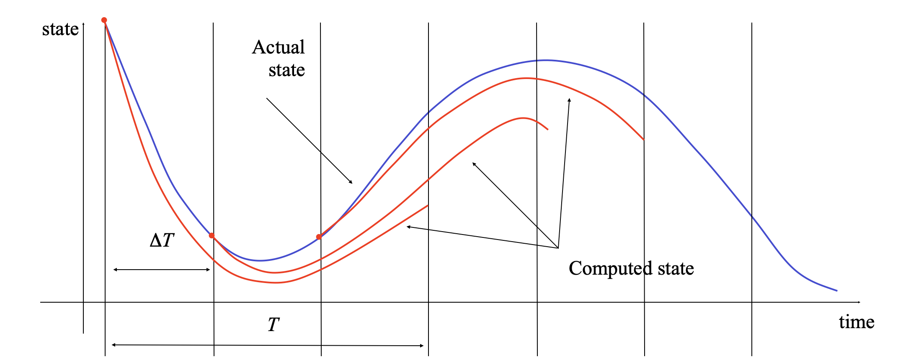

.. _obc-module:

**************************
Optimization-based control
**************************

.. automodule:: control.obc
   :no-members:
   :no-inherited-members:

Optimal control problem setup
=============================

Consider now the *optimal control problem*:

.. math::

  \min_{u(\cdot)} 
  \int_0^T L(x,u)\, dt + V \bigl( x(T) \bigr)

subject to the constraint

.. math::

  \dot x = f(x, u), \qquad x\in\mathbb{R}^n,\, u\in\mathbb{R}^m.

Abstractly, this is a constrained optimization problem where we seek a
*feasible trajectory* :math:`(x(t), u(t))` that minimizes the cost function

.. math::

  J(x, u) = \int_0^T L(x,u)\, dt + V \bigl( x(T) \bigr).

More formally, this problem is equivalent to the "standard" problem of
minimizing a cost function :math:`J(x, u)` where :math:`(x, u) \in L_2[0,T]`
(the set of square integrable functions) and :math:`h(z) = \dot x(t) -
f(x(t), u(t)) = 0` models the dynamics.  The term :math:`L(x, u)` is
referred to as the integral (or trajectory) cost and :math:`V(x(T))` is the
final (or terminal) cost.

It is often convenient to ask that the final value of the trajectory,
denoted :math:`x_\text{f}`, be specified.  We can do this by requiring that
:math:`x(T) = x_\text{f}` or by using a more general form of constraint:

.. math::
   
  \psi_i(x(T)) = 0, \qquad i = 1, \dots, q.

The fully constrained case is obtained by setting :math:`q = n` and defining
:math:`\psi_i(x(T)) = x_i(T) - x_{i,\text{f}}`.  For a control problem with
a full set of terminal constraints, :math:`V(x(T))` can be omitted (since
its value is fixed).

Finally, we may wish to consider optimizations in which either the state or
the inputs are constrained by a set of nonlinear functions of the form

.. math::
   
  \text{lb}_i \leq g_i(x, u) \leq \text{ub}_i, \qquad i = 1, \dots, k.

where :math:`\text{lb}_i` and :math:`\text{ub}_i` represent lower and upper
bounds on the constraint function :math:`g_i`.  Note that these constraints
can be on the input, the state, or combinations of input and state,
depending on the form of :math:`g_i`.  Furthermore, these constraints are
intended to hold at all instants in time along the trajectory.

A common use of optimization-based control techniques is the implementation
of model predictive control (also called receding horizon control).  In
model predict control, a finite horizon optimal control problem is solved,
generating open-loop state and control trajectories.  The resulting control
trajectory is applied to the system for a fraction of the horizon
length. This process is then repeated, resulting in a sampled data feedback
law.  This approach is illustrated in the following figure:

Every :math:`\Delta T` seconds, an optimal control problem is solved over a
:math:`T` second horizon, starting from the current state.  The first
:math:`\Delta T` seconds of the optimal control :math:`u_T^{\*}(\cdot;
x(t))` is then applied to the system. If we let :math:`x_T^{\*}(\cdot;
x(t))` represent the optimal trajectory starting from :math:`x(t)`$ then the
system state evolves from :math:`x(t)` at current time :math:`t` to
:math:`x_T^{*}(\delta T, x(t))` at the next sample time :math:`t + \Delta
T`, assuming no model uncertainty.

In reality, the system will not follow the predicted path exactly, so that
the red (computed) and blue (actual) trajectories will diverge.  We thus
recompute the optimal path from the new state at time :math:`t + \Delta T`,
extending our horizon by an additional :math:`\Delta T` units of time.  This
approach can be shown to generate stabilizing control laws under suitable
conditions (see, for example, the FBS2e supplement on `Optimization-Based
Control <https://fbswiki.org/wiki/index.php/OBC>`_.
  
Module usage
============

The `obc` module provides a means of computing optimal trajectories for
nonlinear systems and implementing optimization-based controllers, including
model predictive control.  It follows the basic problem setup described
above, but carries out all computations in *discrete time* (so that
integrals become sums) and over a *finite horizon*.

To describe an optimal control problem we need an input/output system, a
time horizon, a cost function, and (optionally) a set of constraints on the
state and/or input, either along the trajectory and at the terminal time.
The `obc` module operates by converting the optimal control problem into a
standard optimization problem that can be solved by
:func:`scipy.optimize.minimize`.  The optimal control problem can be solved
by using the `~control.obc.compute_optimal_input` function::

  inputs = obc.compute_optimal_input(sys, horizon, X0, cost, constraints)

The `sys` parameter should be a :class:`~control.InputOutputSystem` and the
`horizon` parameter should represent a time vector that gives the list of
times at which the `cost` and `constraints` should be evaluated.

The `cost` function has call signature `cost(t, x, u)` and should return the
(incremental) cost at the given time, state, and input.  It will be
evaluated at each point in the `horizon` vector.  The `terminal_cost`
parameter can be used to specify a cost function for the final point in the
trajectory.

The `constraints` parameter is a list of constraints similar to that used by
the :func:`scipy.optimize.minimize` function.  Each constraint is a tuple of
one of the following forms::

  (LinearConstraint, A, lb, ub)
  (NonlinearConstraint, f, lb, ub)

For a linear constraint, the 2D array `A` is multiplied by a vector
consisting of the current state `x` and current input `u` stacked
vertically, then compared with the upper and lower bound.  This constrain is
satisfied if

.. code:: python

   lb <= A @ np.hstack([x, u]) <= ub

A nonlinear constraint is satisfied if

.. code:: python

   lb <= f(x, u) <= ub

By default, `constraints` are taken to be trajectory constraints holding at
all points on the trajectory.  The `terminal_constraint` parameter can be
used to specify a constraint that only holds at the final point of the
trajectory.

To simplify the specification of cost functions and constraints, the
:mod:`~control.ios` module defines a number of utility functions:

.. autosummary::

   ~control.obc.quadratic_cost
   ~control.obc.input_poly_constraint
   ~control.obc.input_rank_constraint
   ~control.obc.output_poly_constraint
   ~control.obc.output_rank_constraint
   ~control.obc.state_poly_constraint
   ~control.obc.state_rank_constraint

Example
=======

Consider the vehicle steering example described in FBS2e.  The dynamics of
the system can be defined as a nonlinear input/output system using the
following code::

  import numpy as np
  import control as ct
  import control.obc as obc
  import matplotlib.pyplot as plt

  def vehicle_update(t, x, u, params):
      # Get the parameters for the model
      l = params.get('wheelbase', 3.)         # vehicle wheelbase
      phimax = params.get('maxsteer', 0.5)    # max steering angle (rad)

      # Saturate the steering input
      phi = np.clip(u[1], -phimax, phimax)

      # Return the derivative of the state
      return np.array([
          np.cos(x[2]) * u[0],            # xdot = cos(theta) v
          np.sin(x[2]) * u[0],            # ydot = sin(theta) v
          (u[0] / l) * np.tan(phi)        # thdot = v/l tan(phi)
      ])

  def vehicle_output(t, x, u, params):
      return x                            # return x, y, theta (full state)

  # Define the vehicle steering dynamics as an input/output system
  vehicle = ct.NonlinearIOSystem(
      vehicle_update, vehicle_output, states=3, name='vehicle',
      inputs=('v', 'phi'), outputs=('x', 'y', 'theta'))

We consider an optimal control problem that consists of "changing lanes" by
moving from the point x = 0m, y = -2 m, :math:`\theta` = 0 to the point x =
100m, y = 2 m, :math:`\theta` = 0) over a period of 10 seconds and with a
with a starting and ending velocity of 10 m/s::

  x0 = [0., -2., 0.]; u0 = [10., 0.]
  xf = [100., 2., 0.]; uf = [10., 0.]
  Tf = 10

To set up the optimal control problem we design a cost function that
penalizes the state and input using quadratic cost functions::

  Q = np.diag([10, 10, 1])
  R = np.eye(2) * 0.1
  cost = obc.quadratic_cost(vehicle, Q, R, x0=xf, u0=uf)

We also constraint the maximum turning rate to 0.1 radians (about 6 degees)
and constrain the velocity to be in the range of 9 m/s to 11 m/s::

  constraints = [ obc.input_range_constraint(vehicle, [8, -0.1], [12, 0.1]) ]
  terminal = [ obc.state_range_constraint(vehicle, xf, xf) ]

Finally, we solve for the optimal inputs and plot the results::

  horizon = np.linspace(0, Tf, 20, endpoint=True)
  straight = [10, 0]		# straight trajectory
  bend_left = [10, 0.01]	# slight left veer
  t, u = obc.compute_optimal_input(
      # vehicle, horizon, x0, cost, constraints,
      # initial_guess=straight, logging=True)
      vehicle, horizon, x0, cost, constraints,
      terminal_constraints=terminal, initial_guess=straight)
  t, y = ct.input_output_response(vehicle, horizon, u, x0)

  plt.subplot(3, 1, 1)
  plt.plot(y[0], y[1])
  plt.xlabel("x [m]")
  plt.ylabel("y [m]")

  plt.subplot(3, 1, 2)
  plt.plot(t, u[0])
  plt.xlabel("t [sec]")
  plt.ylabel("u1 [m/s]")

  plt.subplot(3, 1, 3)
  plt.plot(t, u[1])
  plt.xlabel("t [sec]")
  plt.ylabel("u2 [rad/s]")

  plt.suptitle("Lane change manuever")
  plt.tight_layout()
  plt.show()

which yields

.. image:: steer-optimal.png

Module classes and functions
============================
.. autosummary::
   :toctree: generated/

   ~control.obc.OptimalControlProblem
   ~control.obc.compute_optimal_input
   ~control.obc.create_mpc_iosystem
   ~control.obc.input_poly_constraint
   ~control.obc.input_range_constraint
   ~control.obc.output_poly_constraint
   ~control.obc.output_range_constraint
   ~control.obc.state_poly_constraint
   ~control.obc.state_range_constraint
