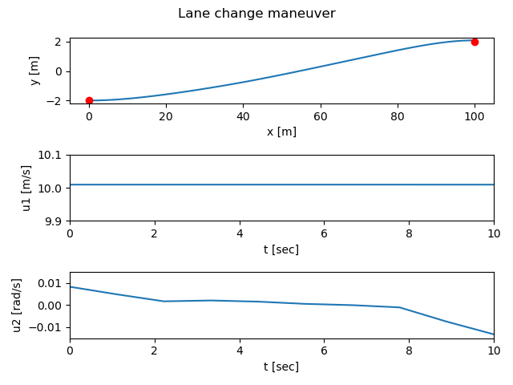

.. _optimal-module:

Optimization-based control
==========================

.. automodule:: control.optimal
   :noindex:
   :no-members:
   :no-inherited-members:
   :no-special-members:

.. currentmodule:: control

Optimal control problem setup
-----------------------------

Consider the *optimal control problem*:

.. math::

  \min_{u(\cdot)}
  \int_0^T L(x,u)\, dt + V \bigl( x(T) \bigr)

subject to the constraint

.. math::

  \dot x = f(x, u), \qquad x\in\mathbb{R}^n,\, u\in\mathbb{R}^m.

Abstractly, this is a constrained optimization problem where we seek a
*feasible trajectory* :math:`(x(t), u(t))` that minimizes the cost function

.. math::

  J(x, u) = \int_0^T L(x, u)\, dt + V \bigl( x(T) \bigr).

More formally, this problem is equivalent to the "standard" problem of
minimizing a cost function :math:`J(x, u)` where :math:`(x, u) \in L_2[0,T]`
(the set of square integrable functions) and :math:`h(z) = \dot x(t) -
f(x(t), u(t)) = 0` models the dynamics.  The term :math:`L(x, u)` is
referred to as the integral (or trajectory) cost and :math:`V(x(T))` is the
final (or terminal) cost.

It is often convenient to ask that the final value of the trajectory,
denoted :math:`x_\text{f}`, be specified.  We can do this by requiring that
:math:`x(T) = x_\text{f}` or by using a more general form of constraint:

.. math::

  \psi_i(x(T)) = 0, \qquad i = 1, \dots, q.

The fully constrained case is obtained by setting :math:`q = n` and defining
:math:`\psi_i(x(T)) = x_i(T) - x_{i,\text{f}}`.  For a control problem with
a full set of terminal constraints, :math:`V(x(T))` can be omitted (since
its value is fixed).

Finally, we may wish to consider optimizations in which either the state or
the inputs are constrained by a set of nonlinear functions of the form

.. math::

  \text{lb}_i \leq g_i(x, u) \leq \text{ub}_i, \qquad i = 1, \dots, k.

where :math:`\text{lb}_i` and :math:`\text{ub}_i` represent lower and upper
bounds on the constraint function :math:`g_i`.  Note that these constraints
can be on the input, the state, or combinations of input and state,
depending on the form of :math:`g_i`.  Furthermore, these constraints are
intended to hold at all instants in time along the trajectory.

For a discrete time system, the same basic formulation applies except
that the cost function is given by

.. math::

  J(x, u) = \sum_{k=0}^{N-1} L(x_k, u_k)\, dt + V(x_N).

A common use of optimization-based control techniques is the implementation
of model predictive control (also called receding horizon control).  In
model predictive control, a finite horizon optimal control problem is solved,
generating open-loop state and control trajectories.  The resulting control
trajectory is applied to the system for a fraction of the horizon
length. This process is then repeated, resulting in a sampled data feedback
law.  This approach is illustrated in the following figure:

.. image:: figures/mpc-overview.png

Every :math:`\Delta T` seconds, an optimal control problem is solved over a
:math:`T` second horizon, starting from the current state.  The first
:math:`\Delta T` seconds of the optimal control :math:`u_T^{\*}(\cdot;
x(t))` is then applied to the system. If we let :math:`x_T^{\*}(\cdot;
x(t))` represent the optimal trajectory starting from :math:`x(t)` then the
system state evolves from :math:`x(t)` at current time :math:`t` to
:math:`x_T^{*}(\delta T, x(t))` at the next sample time :math:`t + \Delta
T`, assuming no model uncertainty.

In reality, the system will not follow the predicted path exactly, so that
the red (computed) and blue (actual) trajectories will diverge.  We thus
recompute the optimal path from the new state at time :math:`t + \Delta T`,
extending our horizon by an additional :math:`\Delta T` units of time.  This
approach can be shown to generate stabilizing control laws under suitable
conditions (see, for example, the FBS2e supplement on `Optimization-Based
Control <https://fbswiki.org/wiki/index.php/OBC>`_.

Module usage
------------

The optimization-based control module provides a means of computing
optimal trajectories for nonlinear systems and implementing
optimization-based controllers, including model predictive control.
It follows the basic problem setups described above, but carries out
all computations in *discrete time* (so that integrals become sums)
and over a *finite horizon*.  To access the optimal control modules,
import `control.optimal`::

  import control.optimal as opt

To describe an optimal control problem we need an input/output system, a
time horizon, a cost function, and (optionally) a set of constraints on the
state and/or input, either along the trajectory and at the terminal time.
The optimal control module operates by converting the optimal control
problem into a standard optimization problem that can be solved by
:func:`scipy.optimize.minimize`.  The optimal control problem can be solved
by using the :func:`optimal.solve_ocp` function::

  res = opt.solve_ocp(sys, timepts, X0, cost, constraints)

The `sys` parameter should be an :class:`InputOutputSystem` and the
`timepts` parameter should represent a time vector that gives the list of
times at which the cost and constraints should be evaluated.

The `cost` function has call signature `cost(t, x, u)` and should return the
(incremental) cost at the given time, state, and input.  It will be
evaluated at each point in the `timepts` vector.  The `terminal_cost`
parameter can be used to specify a cost function for the final point in the
trajectory.

The `constraints` parameter is a list of constraints similar to that used by
the :func:`scipy.optimize.minimize` function.  Each constraint is specified
using one of the following forms::

  LinearConstraint(A, lb, ub)
  NonlinearConstraint(f, lb, ub)

For a linear constraint, the 2D array `A` is multiplied by a vector
consisting of the current state `x` and current input `u` stacked
vertically, then compared with the upper and lower bound.  This constraint
is satisfied if

.. code:: python

   lb <= A @ np.hstack([x, u]) <= ub

A nonlinear constraint is satisfied if

.. code:: python

   lb <= f(x, u) <= ub

By default, `constraints` are taken to be trajectory constraints holding at
all points on the trajectory.  The `terminal_constraint` parameter can be
used to specify a constraint that only holds at the final point of the
trajectory.

The return value for :func:`optimal.solve_ocp` is a bundle object
that has the following elements:

  * `res.success`: `True` if the optimization was successfully solved
  * `res.inputs`: optimal input
  * `res.states`: state trajectory (if `return_x` was `True`)
  * `res.time`: copy of the time timepts vector

In addition, the results from :func:`scipy.optimize.minimize` are also
available.

To simplify the specification of cost functions and constraints, the
:mod:`optimal` module defines a number of utility functions for
optimal control problems:

.. autosummary::

   optimal.quadratic_cost
   optimal.input_poly_constraint
   optimal.input_range_constraint
   optimal.output_poly_constraint
   optimal.output_range_constraint
   optimal.state_poly_constraint
   optimal.state_range_constraint

Example
-------

Consider the vehicle steering example described in FBS2e.  The dynamics of
the system can be defined as a nonlinear input/output system using the
following code::

  import numpy as np
  import control as ct
  import control.optimal as opt
  import matplotlib.pyplot as plt

  def vehicle_update(t, x, u, params):
      # Get the parameters for the model
      l = params.get('wheelbase', 3.)         # vehicle wheelbase
      phimax = params.get('maxsteer', 0.5)    # max steering angle (rad)

      # Saturate the steering input
      phi = np.clip(u[1], -phimax, phimax)

      # Return the derivative of the state
      return np.array([
          np.cos(x[2]) * u[0],            # xdot = cos(theta) v
          np.sin(x[2]) * u[0],            # ydot = sin(theta) v
          (u[0] / l) * np.tan(phi)        # thdot = v/l tan(phi)
      ])

  def vehicle_output(t, x, u, params):
      return x                            # return x, y, theta (full state)

  # Define the vehicle steering dynamics as an input/output system
  vehicle = ct.NonlinearIOSystem(
      vehicle_update, vehicle_output, states=3, name='vehicle',
      inputs=('v', 'phi'), outputs=('x', 'y', 'theta'))

We consider an optimal control problem that consists of "changing lanes" by
moving from the point x = 0 m, y = -2 m, :math:`\theta` = 0 to the point x =
100 m, y = 2 m, :math:`\theta` = 0) over a period of 10 seconds and
with a starting and ending velocity of 10 m/s::

  x0 = np.array([0., -2., 0.]); u0 = np.array([10., 0.])
  xf = np.array([100., 2., 0.]); uf = np.array([10., 0.])
  Tf = 10

To set up the optimal control problem we design a cost function that
penalizes the state and input using quadratic cost functions::

  Q = np.diag([0, 0, 0.1])          # don't turn too sharply
  R = np.diag([1, 1])               # keep inputs small
  P = np.diag([1000, 1000, 1000])   # get close to final point
  traj_cost = opt.quadratic_cost(vehicle, Q, R, x0=xf, u0=uf)
  term_cost = opt.quadratic_cost(vehicle, P, 0, x0=xf)

We also constrain the maximum turning rate to 0.1 radians (about 6 degrees)
and constrain the velocity to be in the range of 9 m/s to 11 m/s::

  constraints = [ opt.input_range_constraint(vehicle, [8, -0.1], [12, 0.1]) ]

Finally, we solve for the optimal inputs::

  timepts = np.linspace(0, Tf, 10, endpoint=True)
  result = opt.solve_ocp(
      vehicle, timepts, x0, traj_cost, constraints,
      terminal_cost=term_cost, initial_guess=u0)

Plotting the results::

  # Simulate the system dynamics (open loop)
  resp = ct.input_output_response(
      vehicle, timepts, result.inputs, x0,
      t_eval=np.linspace(0, Tf, 100))
  t, y, u = resp.time, resp.outputs, resp.inputs

  plt.subplot(3, 1, 1)
  plt.plot(y[0], y[1])
  plt.plot(x0[0], x0[1], 'ro', xf[0], xf[1], 'ro')
  plt.xlabel("x [m]")
  plt.ylabel("y [m]")

  plt.subplot(3, 1, 2)
  plt.plot(t, u[0])
  plt.axis([0, 10, 9.9, 10.1])
  plt.xlabel("t [sec]")
  plt.ylabel("u1 [m/s]")

  plt.subplot(3, 1, 3)
  plt.plot(t, u[1])
  plt.axis([0, 10, -0.015, 0.015])
  plt.xlabel("t [sec]")
  plt.ylabel("u2 [rad/s]")

  plt.suptitle("Lane change maneuver")
  plt.tight_layout()
  plt.show()

yields

An example showing the use of the optimal estimation problem and moving
horizon estimation (MHE) is given in the :doc:`mhe-pvtol Jupyter
notebook <examples/mhe-pvtol>`.

Optimization Tips
-----------------

The python-control optimization module makes use of the SciPy optimization
toolbox and it can sometimes be tricky to get the optimization to converge.
If you are getting errors when solving optimal control problems or your
solutions do not seem close to optimal, here are a few things to try:

* The initial guess matters: providing a reasonable initial guess is often
  needed in order for the optimizer to find a good answer.  For an optimal
  control problem that uses a larger terminal cost to get to a neighborhood
  of a final point, a straight line in the state space often works well.

* Less is more: try using a smaller number of time points in your
  optimization.  The default optimal control problem formulation uses the
  value of the inputs at each time point as a free variable and this can
  generate a large number of parameters quickly.  Often you can find very
  good solutions with a small number of free variables (the example above
  uses 3 time points for 2 inputs, so a total of 6 optimization variables).
  Note that you can "resample" the optimal trajectory by running a
  simulation of the system and using the `t_eval` keyword in
  `input_output_response` (as done above).

* Use a smooth basis: as an alternative to parameterizing the optimal
  control inputs using the value of the control at the listed time points,
  you can specify a set of basis functions using the `basis` keyword in
  :func:`solve_ocp` and then parameterize the controller by linear
  combination of the basis functions.  The :mod:`!control.flatsys` module
  defines several sets of basis functions that can be used.

* Tweak the optimizer: by using the `minimize_method`, `minimize_options`,
  and `minimize_kwargs` keywords in :func:`solve_ocp`, you can
  choose the SciPy optimization function that you use and set many
  parameters.  See :func:`scipy.optimize.minimize` for more information on
  the optimizers that are available and the options and keywords that they
  accept.

* Walk before you run: try setting up a simpler version of the optimization,
  remove constraints or simplifying the cost to get a simple version of the
  problem working and then add complexity.  Sometimes this can help you find
  the right set of options or identify situations in which you are being too
  aggressive in what you are trying to get the system to do.

See :ref:`steering-optimal` for some examples of different problem
formulations.

Module classes and functions
----------------------------

The following classes and functions are defined in the
`optimal` module:

.. autosummary::
   :template: custom-class-template.rst

   optimal.OptimalControlProblem
   optimal.OptimalControlResult
   optimal.OptimalEstimationProblem
   optimal.OptimalEstimationResult

.. autosummary::

   optimal.create_mpc_iosystem
   optimal.disturbance_range_constraint
   optimal.gaussian_likelihood_cost
   optimal.input_poly_constraint
   optimal.input_range_constraint
   optimal.output_poly_constraint
   optimal.output_range_constraint
   optimal.quadratic_cost
   optimal.solve_ocp
   optimal.solve_oep
   optimal.state_poly_constraint
   optimal.state_range_constraint
