.. _plotting-module:

*************
Plotting data
*************

The Python Control Systems Toolbox contains a number of functions for
plotting input/output responses in the time and frequency domain, root
locus diagrams, and other standard charts used in control system analysis,
for example::

  bode_plot(sys)
  nyquist_plot([sys1, sys2])
  phase_plane_plot(sys, limits)
  pole_zero_plot(sys)
  root_locus_plot(sys)

While plotting functions can be called directly, the standard pattern used
in the toolbox is to provide a function that performs the basic computation
or analysis (e.g., computation of the time or frequency response) and
returns and object representing the output data.  A separate plotting
function, typically ending in `_plot` is then used to plot the data,
resulting in the following standard pattern::

  response = ct.nyquist_response([sys1, sys2])
  count = ct.response.count          # number of encirclements of -1
  lines = ct.nyquist_plot(response)  # Nyquist plot

The returned value `lines` provides access to the individual lines in the
generated plot, allowing various aspects of the plot to be modified to suit
specific needs.

The plotting function is also available via the `plot()` method of the
analysis object, allowing the following type of calls::

  step_response(sys).plot()
  frequency_response(sys).plot()
  nyquist_response(sys).plot()
  pp.streamlines(sys, limits).plot()
  root_locus_map(sys).plot()

The remainder of this chapter provides additional documentation on how
these response and plotting functions can be customized.

Time response data
==================

Input/output time responses are produced one of several python-control
functions: :func:`~control.forced_response`,
:func:`~control.impulse_response`, :func:`~control.initial_response`,
:func:`~control.input_output_response`, :func:`~control.step_response`.
Each of these return a :class:`~control.TimeResponseData` object, which
contains the time, input, state, and output vectors associated with the
simulation. Time response data can be plotted with the
:func:`~control.time_response_plot` function, which is also available as
the :func:`~control.TimeResponseData.plot` method.  For example, the step
response for a two-input, two-output can be plotted using the commands::

  sys_mimo = ct.tf2ss(
      [[[1], [0.1]], [[0.2], [1]]],
      [[[1, 0.6, 1], [1, 1, 1]], [[1, 0.4, 1], [1, 2, 1]]], name="sys_mimo")
  response = ct.step_response(sys)
  response.plot()

which produces the following plot:

.. image:: timeplot-mimo_step-default.png

The  :class:`~control.TimeResponseData` object can also be used to access
the data from the simulation::

  time, outputs, inputs = response.time, response.outputs, response.inputs
  fig, axs = plt.subplots(2, 2)
  for i in range(2):
      for j in range(2):
          axs[i, j].plot(time, outputs[i, j])

A number of options are available in the `plot` method to customize
the appearance of input output data.  For data produced by the
:func:`~control.impulse_response` and :func:`~control.step_response`
commands, the inputs are not shown.  This behavior can be changed
using the `plot_inputs` keyword.  It is also possible to combine
multiple lines onto a single graph, using either the `overlay_signals`
keyword (which puts all outputs out a single graph and all inputs on a
single graph) or the `overlay_traces` keyword, which puts different
traces (e.g., corresponding to step inputs in different channels) on
the same graph, with appropriate labeling via a legend on selected
axes.

For example, using `plot_input=True` and `overlay_signals=True` yields the
following plot::

      ct.step_response(sys_mimo).plot(
        plot_inputs=True, overlay_signals=True,
        title="Step response for 2x2 MIMO system " +
        "[plot_inputs, overlay_signals]")

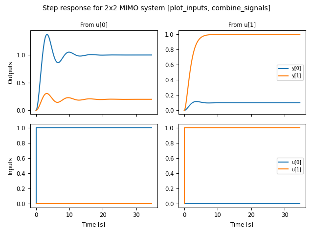

Input/output response plots created with either the
:func:`~control.forced_response` or the
:func:`~control.input_output_response` functions include the input signals by
default. These can be plotted on separate axes, but also "overlaid" on the
output axes (useful when the input and output signals are being compared to
each other).  The following plot shows the use of `plot_inputs='overlay'`
as well as the ability to reposition the legends using the `legend_map`
keyword::

    timepts = np.linspace(0, 10, 100)
    U = np.vstack([np.sin(timepts), np.cos(2*timepts)])
    ct.input_output_response(sys_mimo, timepts, U).plot(
        plot_inputs='overlay',
        legend_map=np.array([['lower right'], ['lower right']]),
        title="I/O response for 2x2 MIMO system " +
        "[plot_inputs='overlay', legend_map]")

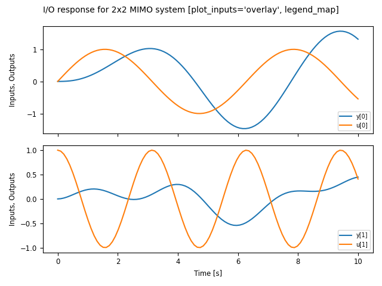

Another option that is available is to use the `transpose` keyword so that
instead of plotting the outputs on the top and inputs on the bottom, the
inputs are plotted on the left and outputs on the right, as shown in the
following figure::

    U1 = np.vstack([np.sin(timepts), np.cos(2*timepts)])
    resp1 = ct.input_output_response(sys_mimo, timepts, U1)

    U2 = np.vstack([np.cos(2*timepts), np.sin(timepts)])
    resp2 = ct.input_output_response(sys_mimo, timepts, U2)

    ct.combine_time_responses(
        [resp1, resp2], trace_labels=["Scenario #1", "Scenario #2"]).plot(
            transpose=True,
            title="I/O responses for 2x2 MIMO system, multiple traces "
            "[transpose]")

.. image:: timeplot-mimo_ioresp-mt_tr.png

This figure also illustrates the ability to create "multi-trace" plots
using the :func:`~control.combine_time_responses` function.  The line
properties that are used when combining signals and traces are set by
the `input_props`, `output_props` and `trace_props` parameters for
:func:`~control.time_response_plot`.

Additional customization is possible using the `input_props`,
`output_props`, and `trace_props` keywords to set complementary line colors
and styles for various signals and traces::

    out = ct.step_response(sys_mimo).plot(
        plot_inputs='overlay', overlay_signals=True, overlay_traces=True,
        output_props=[{'color': c} for c in ['blue', 'orange']],
        input_props=[{'color': c} for c in ['red', 'green']],
        trace_props=[{'linestyle': s} for s in ['-', '--']])

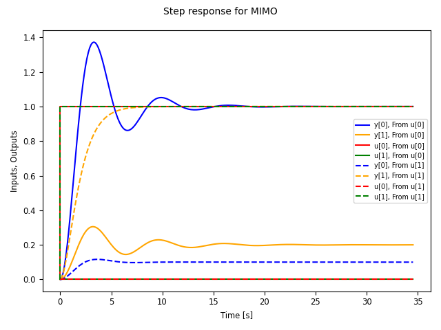

Frequency response data
=======================

Linear time invariant (LTI) systems can be analyzed in terms of their
frequency response and python-control provides a variety of tools for
carrying out frequency response analysis.  The most basic of these is
the :func:`~control.frequency_response` function, which will compute
the frequency response for one or more linear systems::

  sys1 = ct.tf([1], [1, 2, 1], name='sys1')
  sys2 = ct.tf([1, 0.2], [1, 1, 3, 1, 1], name='sys2')
  response = ct.frequency_response([sys1, sys2])

A Bode plot provide a graphical view of the response an LTI system and can
be generated using the :func:`~control.bode_plot` function::

  ct.bode_plot(response, initial_phase=0)

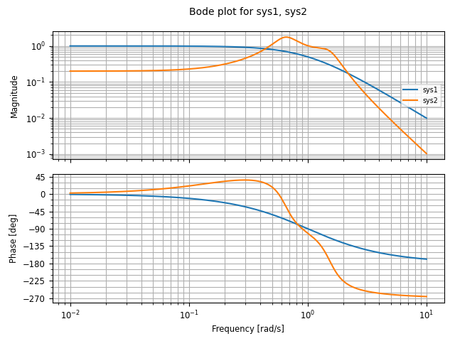

Computing the response for multiple systems at the same time yields a
common frequency range that covers the features of all listed systems.

Bode plots can also be created directly using the
:meth:`~control.FrequencyResponseData.plot` method::

  sys_mimo = ct.tf(
      [[[1], [0.1]], [[0.2], [1]]],
      [[[1, 0.6, 1], [1, 1, 1]], [[1, 0.4, 1], [1, 2, 1]]], name="sys_mimo")
  ct.frequency_response(sys_mimo).plot()

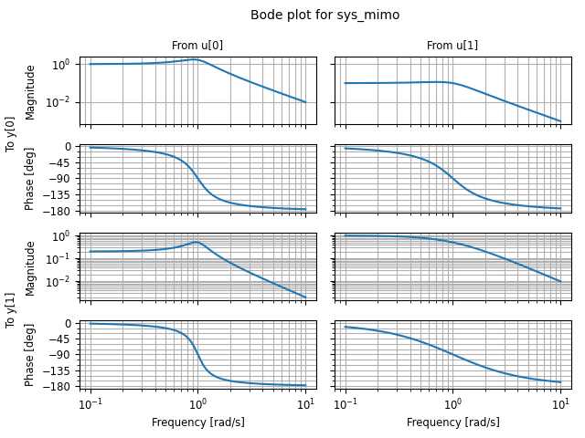

A variety of options are available for customizing Bode plots, for
example allowing the display of the phase to be turned off or
overlaying the inputs or outputs::

  ct.frequency_response(sys_mimo).plot(
      plot_phase=False, overlay_inputs=True, overlay_outputs=True)

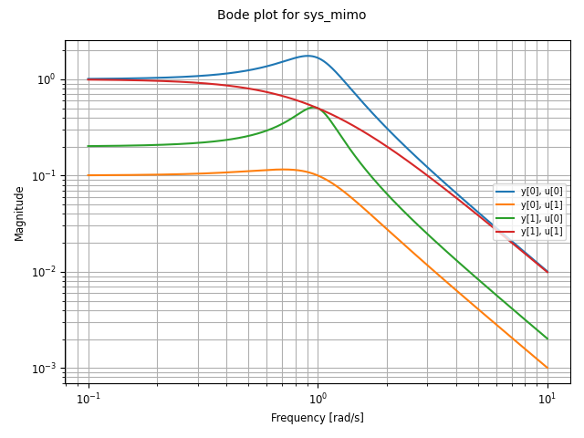

The :func:`~ct.singular_values_response` function can be used to
generate Bode plots that show the singular values of a transfer
function::

  ct.singular_values_response(sys_mimo).plot()

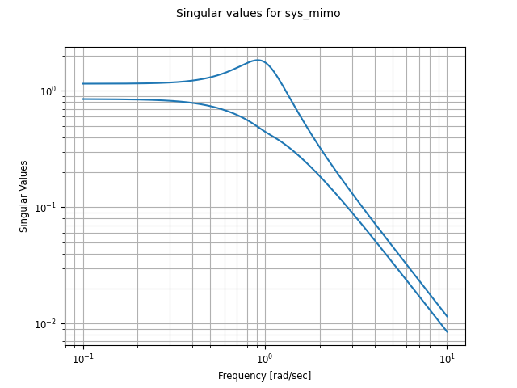

Different types of plots can also be specified for a given frequency
response.  For example, to plot the frequency response using a a Nichols
plot, use `plot_type='nichols'`::

  response.plot(plot_type='nichols')

.. image:: freqplot-siso_nichols-default.png

Another response function that can be used to generate Bode plots is
the :func:`~ct.gangof4` function, which computes the four primary
sensitivity functions for a feedback control system in standard form::

    proc = ct.tf([1], [1, 1, 1], name="process")
    ctrl = ct.tf([100], [1, 5], name="control")
    response = rect.gangof4_response(proc, ctrl)
    ct.bode_plot(response)	# or response.plot()

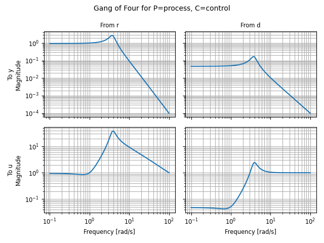

Pole/zero data
==============

Pole/zero maps and root locus diagrams provide insights into system
response based on the locations of system poles and zeros in the complex
plane.  The :func:`~control.pole_zero_map` function returns the poles and
zeros and can be used to generate a pole/zero plot::

  sys = ct.tf([1, 2], [1, 2, 3], name='SISO transfer function')
  response = ct.pole_zero_map(sys)
  ct.pole_zero_plot(response)

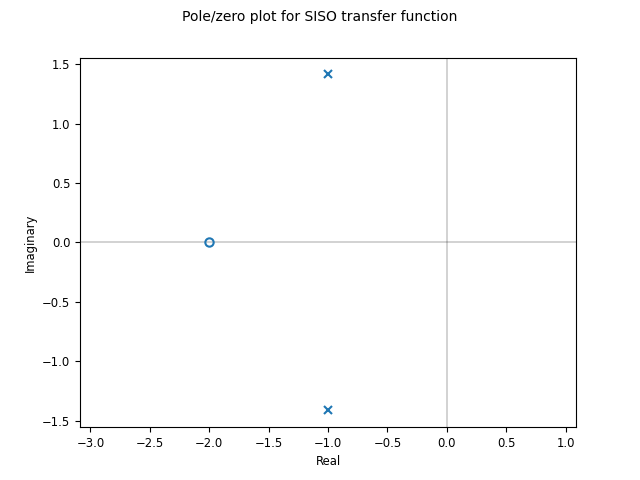

A root locus plot shows the location of the closed loop poles of a system
as a function of the loop gain::

  ct.root_locus_map(sys).plot()

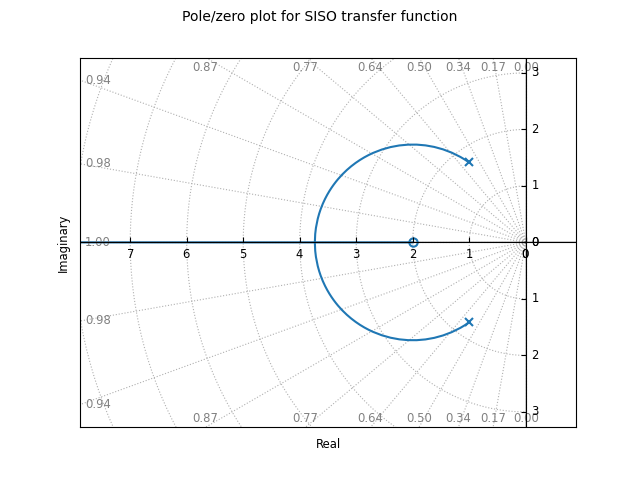

The grid in the left hand plane shows lines of constant damping ratio as
well as arcs corresponding to the frequency of the complex pole.  The grid
can be turned off using the `grid` keyword.  Setting `grid` to `False` will
turn off the grid but show the real and imaginary axis.  To completely
remove all lines except the root loci, use `grid='empty'`.

On systems that support interactive plots, clicking on a location on the
root locus diagram will mark the pole locations on all branches of the
diagram and display the gain and damping ratio for the clicked point below
the plot title:

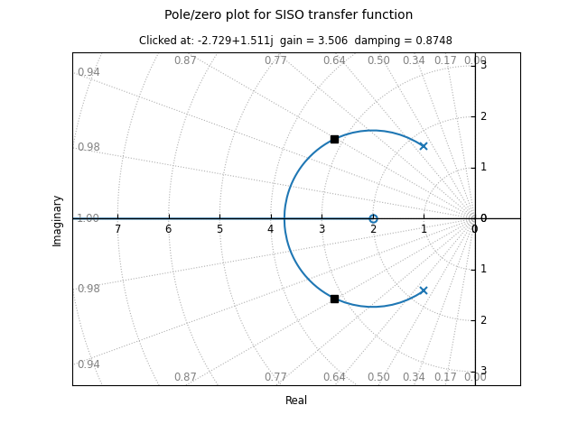

Root locus diagrams are also supported for discrete time systems, in which
case the grid is show inside the unit circle::

  sysd = sys.sample(0.1)
  ct.root_locus_plot(sysd)

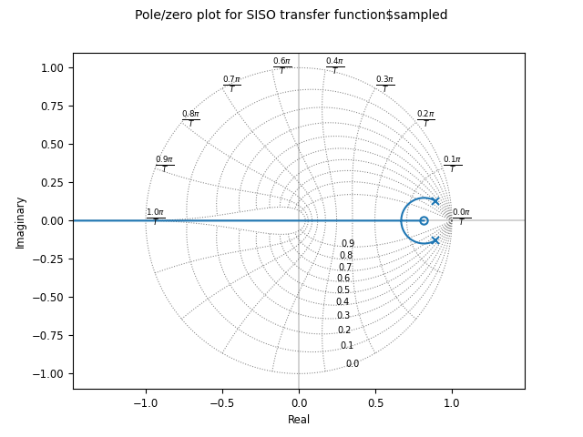

Lists of systems can also be given, in which case the root locus diagram
for each system is plotted in different colors::

  sys1 = ct.tf([1], [1, 2, 1], name='sys1')
  sys2 = ct.tf([1, 0.2], [1, 1, 3, 1, 1], name='sys2')
  ct.root_locus_plot([sys1, sys2], grid=False)

.. image:: rlocus-siso_multiple-nogrid.png

Phase plane plots
=================
Insight into nonlinear systems can often be obtained by looking at phase
plane diagrams.  The :func:`~control.phase_plane_plot` function allows the
creation of a 2-dimensional phase plane diagram for a system.  This
functionality is supported by a set of mapping functions that are part of
the `phaseplot` module.

The default method for generating a phase plane plot is to provide a
2D dynamical system along with a range of coordinates and time limit::

    sys = ct.nlsys(
        lambda t, x, u, params: np.array([[0, 1], [-1, -1]]) @ x, 
        states=['position', 'velocity'], inputs=0, name='damped oscillator')
    axis_limits = [-1, 1, -1, 1]
    T = 8
    ct.phase_plane_plot(sys, axis_limits, T)

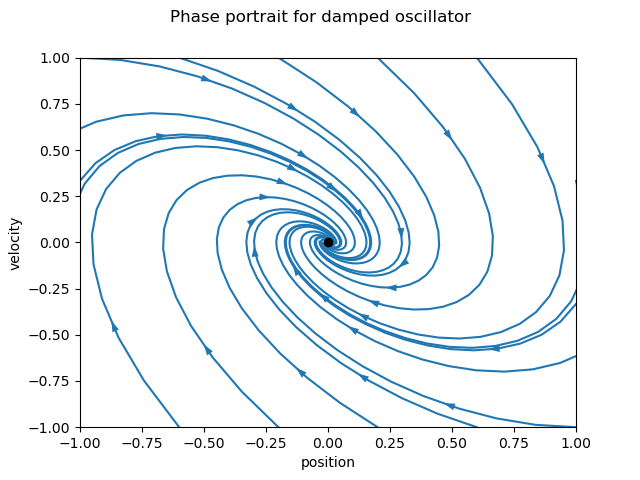

By default, the plot includes streamlines generated from starting
points on limits of the plot, with arrows showing the flow of the
system, as well as any equilibrium points for the system.  A variety
of options are available to modify the information that is plotted,
including plotting a grid of vectors instead of streamlines and
turning on and off various features of the plot.

To illustrate some of these possibilities, consider a phase plane plot for
an inverted pendulum system, which is created using a mesh grid::

    def invpend_update(t, x, u, params):
        m, l, b, g = params['m'], params['l'], params['b'], params['g']
        return [x[1], -b/m * x[1] + (g * l / m) * np.sin(x[0]) + u[0]/m]
    invpend = ct.nlsys(invpend_update, states=2, inputs=1, name='invpend')
        
    ct.phase_plane_plot(
        invpend, [-2*pi, 2*pi, -2, 2], 5,
        gridtype='meshgrid', gridspec=[5, 8], arrows=3,
        plot_equilpoints={'gridspec': [12, 9]},
        params={'m': 1, 'l': 1, 'b': 0.2, 'g': 1})
    plt.xlabel(r"$\theta$ [rad]")
    plt.ylabel(r"$\dot\theta$ [rad/sec]")
    
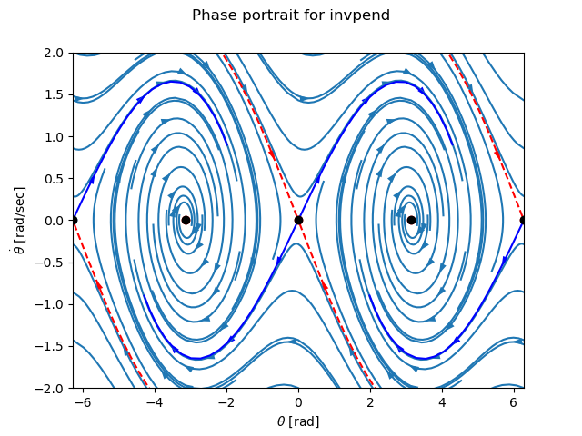

This figure shows several features of more complex phase plane plots:
multiple equilibrium points are shown, with saddle points showing
separatrices, and streamlines generated along a 5x8 mesh of initial
conditions.  At each mesh point, a streamline is created that goes 5 time
units forward and backward in time.  A separate grid specification is used
to find equilibrium points and separatrices (since the course grid spacing
of 5x8 does not find all possible equilibrium points).  Together, the
multiple features in the phase plane plot give a good global picture of the
topological structure of solutions of the dynamical system.

Phase plots can be built up by hand using a variety of helper functions that
are part of the :mod:`~control.phaseplot` (pp) module::

    import control.phaseplot as pp

    def oscillator_update(t, x, u, params):
        return [x[1] + x[0] * (1 - x[0]**2 - x[1]**2),
                -x[0] + x[1] * (1 - x[0]**2 - x[1]**2)]
    oscillator = ct.nlsys(
        oscillator_update, states=2, inputs=0, name='nonlinear oscillator')
  
    ct.phase_plane_plot(oscillator, [-1.5, 1.5, -1.5, 1.5], 0.9)
    pp.streamlines(
        oscillator, np.array([[0, 0]]), 1.5,
        gridtype='circlegrid', gridspec=[0.5, 6], dir='both')
    pp.streamlines(
        oscillator, np.array([[1, 0]]), 2*pi, arrows=6, color='b')
    plt.gca().set_aspect('equal')

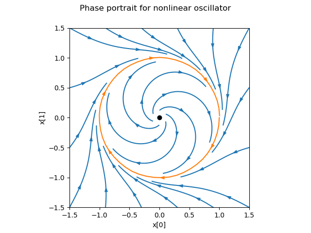

The following helper functions are available:

.. autosummary::
   ~control.phaseplot.equilpoints
   ~control.phaseplot.separatrices
   ~control.phaseplot.streamlines
   ~control.phaseplot.vectorfield

The :func:`~control.phase_plane_plot` function calls these helper functions
based on the options it is passed.

Note that unlike other plotting function, phase plane plots do not involve
computing a response and then plotting the result via a `plot()` method.
Instead, the plot is generated directly be a call to the
:func:`~control.phase_plane_plot` function (or one of the
:mod:`~control.phaseplot` helper functions.

Response and plotting functions
===============================

Response functions
------------------

Response functions take a system or list of systems and return a response
object that can be used to retrieve information about the system (e.g., the
number of encirclements for a Nyquist plot) as well as plotting (via the
`plot` method).

.. autosummary::
   :toctree: generated/

   ~control.describing_function_response
   ~control.frequency_response
   ~control.forced_response
   ~control.gangof4_response
   ~control.impulse_response
   ~control.initial_response
   ~control.input_output_response
   ~control.nyquist_response
   ~control.pole_zero_map
   ~control.root_locus_map
   ~control.singular_values_response
   ~control.step_response

Plotting functions
------------------

.. autosummary::
   :toctree: generated/

   ~control.bode_plot
   ~control.describing_function_plot
   ~control.nichols_plot
   ~control.phase_plane_plot
   ~control.phaseplot.equilpoints
   ~control.phaseplot.separatrices
   ~control.phaseplot.streamlines
   ~control.phaseplot.vectorfield
   ~control.pole_zero_plot
   ~control.root_locus_plot
   ~control.singular_values_plot
   ~control.time_response_plot

Utility functions
-----------------

These additional functions can be used to manipulate response data or
returned values from plotting routines.

.. autosummary::
   :toctree: generated/

   ~control.combine_time_responses
   ~control.get_plot_axes

Response classes
----------------

The following classes are used in generating response data.

.. autosummary::
   :toctree: generated/

   ~control.DescribingFunctionResponse
   ~control.FrequencyResponseData
   ~control.NyquistResponseData
   ~control.PoleZeroData
   ~control.TimeResponseData
