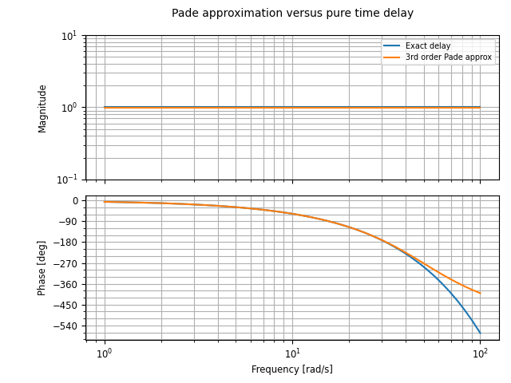

.. currentmodule:: control

Frequency Domain Analysis and Design
====================================

Transfer function properties
----------------------------

The following basic attributes and methods are available for
:class:`TransferFunction` objects:

.. autosummary::

   ~TransferFunction.num_array
   ~TransferFunction.den_array
   ~TransferFunction.shape
   ~TransferFunction.poles
   ~TransferFunction.zeros
   ~TransferFunction.dcgain
   ~TransferFunction.sample
   ~TransferFunction.returnScipySignalLTI
   ~TransferFunction.__call__

A complete list of attributes, methods, and properties is available in
the :class:`TransferFunction` class documentation.

Frequency domain properties
---------------------------

The following functions are available to analyze the frequency
domain properties of a linear systems:

.. autosummary::

   bandwidth
   dcgain
   frequency_response
   phase_crossover_frequencies
   singular_values_response
   stability_margins
   tfdata

These functions work on both state space and transfer function models.
The :func:`frequency_response` and :func:`singular_values_response`
functions are described in more detail in the :ref:`response-chapter`
chapter.

Input/output norms
------------------

Continuous and discrete-time signals can be represented as a normed
linear space with the appropriate choice of signal norm.  For
continuous time signals, the three most common norms are the 1-norm,
2-norm, and the :math:`\infty`-norm:

.. list-table::
   :header-rows: 1

   * - Name
     - Continuous time
     - Discrete time
   * - 1-norm
     - :math:`\int_{-\infty}^\infty |u(\tau)|, d\tau`
     - :math:`\sum_k \|x[k]\|`
   * - 2-norm
     - :math:`\left(\int_{-\infty}^\infty |u(\tau)|^2, d\tau \right)^{1/2}`
     - :math:`\left(\sum_k \|x[k]\|^2 \right)^{1/2}`
   * - :math:`\infty`-norm
     - :math:`\sup_t |u(t)|`
     - :math:`\max_k \|x[k]\|`

Given a norm for input signals and a norm for output signals, we can
define the *induced norm* for an input/output system.  The
following table summarizes the induced norms for a transfer function
:math:`G(s)` with impulse response :math:`g(t)`:

.. list-table::
   :header-rows: 1

   * -
     - :math:`\|u\|_2`
     - :math:`\| u \|_\infty`
   * - :math:`\| y \|_2`
     - :math:`\| G \|_\infty`
     - :math:`\infty`
   * - :math:`\| y \|_\infty`
     - :math:`\| G \|_2`
     - :math:`\| g \|_1`

The system 2-norm and :math:`\infty`-norm can be computed using
:func:`system_norm`::

  sysnorm = ct.system_norm(sys, p=<val>)

where `val` is either 2 or 'inf' (the 1-norm is not yet implemented).

Stability margins
-----------------

The stability margin of a system indicates the robustness of a
feedback system to perturbations that might cause the system to become
unstable.  Standard measures of robustness include gain margin, phase
margin, and stability margin (distance to the -1 point on the Nyquist
curve).  These margins are computed based on the loop transfer
function for a feedback system, assuming the loop will be closed using
negative feedback with gain 1.

The :func:`stability_margins` function computes all three of these
margins as well as the frequencies at which they occur:

.. doctest::

  >>> sys = ct.tf(10, [1, 2, 3, 4])
  >>> gm, pm, sm, wpc, wgc, wms = ct.stability_margins(sys)
  >>> print(f"Gain margin: {gm:2.2} at omega = {wpc:2.2} rad/sec")
  Gain margin: 0.2 at omega = 1.7 rad/sec

Frequency domain synthesis
--------------------------

Synthesis of feedback controllers in the frequency domain can be done
using the following functions:

.. autosummary::

   h2syn
   hinfsyn
   mixsyn

The :func:`mixsyn` function computes a feedback controller
:math:`C(s)` that minimizes the mixed sensitivity gain

.. math::

   \| W_1 S \|_\infty + \| W_2 C \|_\infty + \| W_3 T \|_\infty,

where

.. math::

   S = \frac{1}{1 + P C}, \qquad T = \frac{P C}{1 + P C}

are the sensitivity function and complementary sensitivity function,
and :math:`P(s)` represents the process dynamics.

The :func:`h2syn` and :func:`hinfsyn` functions compute a feedback
controller :math:`C(s)` that minimizes the 2-norm and the
:math:`\infty`-norm of the sensitivity function for the closed loop
system, respectively.

Systems with time delays
------------------------

Time delays are not directly representable in `python-control`, but
the :func:`pade` function generates a linear system that approximates
a time delay to a given order:

.. doctest::

  >>> num, den = ct.pade(0.1, 3)
  >>> delay = ct.tf(num, den, name='delay')
  >>> print(delay)
  <TransferFunction>: delay
  Inputs (1): ['u[0]']
  Outputs (1): ['y[0]']
  <BLANKLINE>
    -s^3 + 120 s^2 - 6000 s + 1.2e+05
    ---------------------------------
    s^3 + 120 s^2 + 6000 s + 1.2e+05

The plot below shows how the Pade approximation compares to a pure
time delay.

.. testcode::
  :hide:

  import matplotlib.pyplot as plt
  omega = np.logspace(0, 2)
  delay_exact = ct.FrequencyResponseData(np.exp(-0.1j * omega ), omega)
  cplt = ct.bode_plot(
      [delay_exact/0.98, delay*0.98], omega, legend_loc='upper right',
      label=['Exact delay', '3rd order Pade approx'],
      title="Pade approximation versus pure time delay")
  cplt.axes[0, 0].set_ylim([0.1, 10])
  plt.savefig('figures/xferfcn-delay-compare.png')

